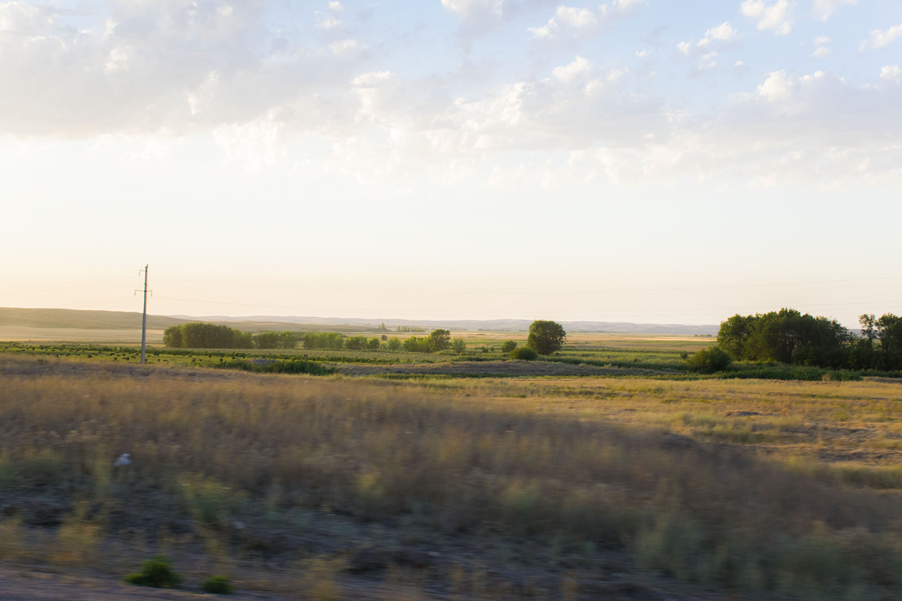
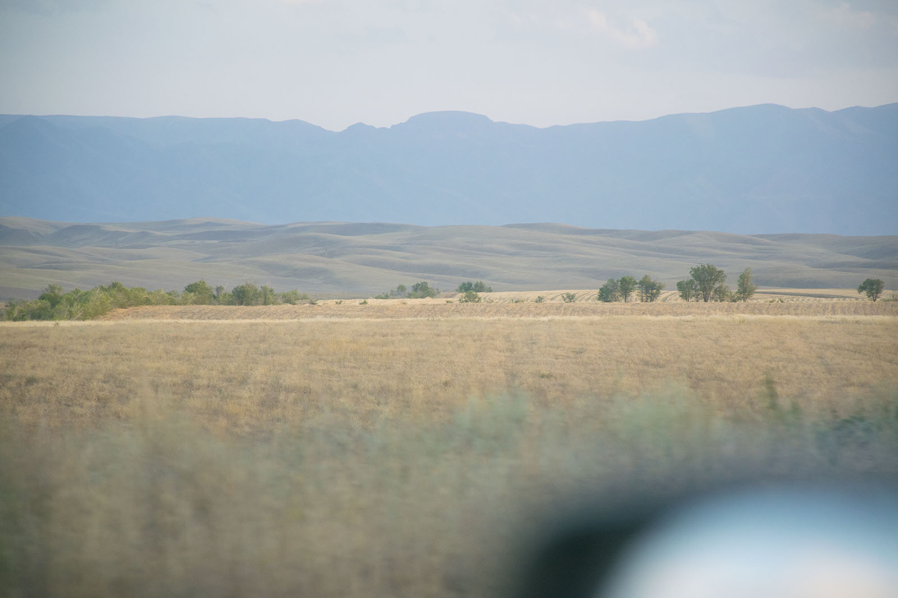

Jutro in udobna mehka postelja, ki nama napolni baterije. Sledi blamaža s tušem, ki naju prepriča, da ne dela, zato pokličeva na recepcijo. In ni boljšega, kot to, da pride varnostnik, odpre pipo in meni nič, tebi nič, voda priteče. Zasluženo požreva gospodov pogled (nekaj med posmehom in ali je meni res tega treba). Vrneva se v Iskracom in se odločiva za izredno sejo – beri, odstopijo nama sejno sobo, da posodobiva blog. Lep dan ne gre preživeti za štirimi stenami, zato se odpraviva v mesto, zaideva v neko menzo in izkusiva pristno kazahstansko kuhinjo. Ni slaba. Komaj premikajoča se, se odločiva še za sladico (ta mora pa ja biti). V parku in s sladoledom v roki, okupirava klopco in opazujeva mimoidoče, pa golobe, drevesa – ah dobro imate naju – tokrat nisva počela popolnoma nič. Vse štiri od sebe :).

 Gneča iz Almatyja.

To je predpriprava na vožnjo, na katero se podava proti večeru. Tokrat ima Katja le srečo in cesta se je usmili , da po njej lahko pelje tam nekje okoli omejitev. Izgubiva se nekje med hribovito pokrajino (ampak ne dobesedno), ki jo iz ure v uro vidiva slabše, a naju ne skrbi, da bi kaj zamudila, ker se bova po isti poti vračala nazaj. Med vožnjo nama odpove desna žarnica in čas je za prvo popravilo – serviser Matej išče žarnico vsepovsod, Katja pa jo najde v prvi košari (1:0 za žensko intuicijo).

 Serviser Matej... ali bolje, Iskalec.

Že sva nazaj na poti. Matej si uredi sovoznikov prostor v domačo popotniško pisarno in pridno presnemava slike. Zadnje kilometre proti meji se hitrost zmanjšuje in v koloni se peljemo do konca Kazahstana. Meter za metrom se pomikamo proti rampi, ki označuje začetek meje. Matej se takoj zagovori z nekim voznikom, ki poda nekaj nasvetov in spodbud. Malo pred mejo se odločiva, da bo verjetno vseeno pametneje, če se voznika zamenjava, ker je videti, da so stražarji zelo zgovorni, kar zna za Katjo predstavljati manjši problem (angleščina ali nemščina pač ne gresta skozi). Še dobro, ker običajno pride do manjše zmešnjave. In tudi tokratna meja ni izjema. Eden od stražarjev naju napoti v bližnjo stavbo, da se registrirava. Ko se vračava nazaj pa naju prestreže drugi in začne spraševati, kaj se greva. Problem nastane, ker bi moral voznik avta (skupaj z vozilom)čez drug postopek, vsi potniki pa čez mejo kar peš. In tu se Matej in Katja ločita. (evo pa imava me time :) )

Matej pade v neskončno sprehajanje iz enega okenca do drugega, urejanja dokumentov, pregovarjanja pijanih carinikov, napotijo ga celo čez mejo, da gre fotokopirat edini dokument, katerega kopije nimava. Postopek se zavleče za dobro uro in pol. Medtem Katja pomaga domačinki prenesti dvajset litrov mleka čez mejo – upam, da nisem česa tihotapila, se pogovori (nekaj v angleščini, nekaj pa v pantomimi) s stražarji, nato pa ji preostane le še čakanje s preostalimi ljudmi. A kaj, ko vsi odhajajo, jaz pa še vedno na obrobju v družbi potepuških psov in oblečena, kot da bi bilo 35 stopinj. Proti koncu čakanja le dobim družbo nekega kazahstanskega fanta, s katerim se zapletem v pogovor. Kmalu se pridruži še Matej in odpraviva se naprej proti Biškeku, ki je le 20 kilometrov stran od meje. A ustaviva se že po slabih sto metrih, ker naju ustavi mlad vojak z brzostrelko. Prevozila sva stop znak, ki se skriva za namerno postavljenim tovornjakom. Mateja čaka zagovor in izpogaja se, da uideva kazni. Ne uideva pa podkupnini, ki znaša 10.000 teng.

 Zanimiva Kazaška pokopališča.

Dogodivščin ne zmanjka niti v Biškeku, kjer naju ustavijo policaji – zapeljala sva v enosmerno ulico. (Kar sploh ni težko, če v mestu ni žive duše, kaj šele vozila ali prometnega znaka, se pa ponoči znajdejo poleg naju policaji.) Pospremita naju do hotela, ki ga priporočita, se navdušita nad projektom in seveda, vprašata, kako se bomo dogovorili. Še dobro, da sva od strica Ivana pred odhodom dobila dežnik, ker se je policaj popolnoma zagledal vanj. Tako so svoje potovanje do Mongolije predčasno zaključili dežnik in dva sponzorska polnilca za mobitel. Da ne bi srečala še koga, ki bi ga bilo potrebno podkupiti, se hitro odpraviva spat.

 Matejeva pisarna v "dnevni sobi". Diski, GPSi, polnjenje kamer ipd.

Seveda se zmotiva in morava pri parkiranju avtomobila za hotelsko ograjo plačati gospodiču, ki nama to ograjo odpre kljub temu, da gospa receptorka pove, da to pa res ni noben problem. Ja no, vdava se. Fan fact: xerox v kirgizistanščini pomeni fotokopija (po prvem fotokopirnem stroju).
