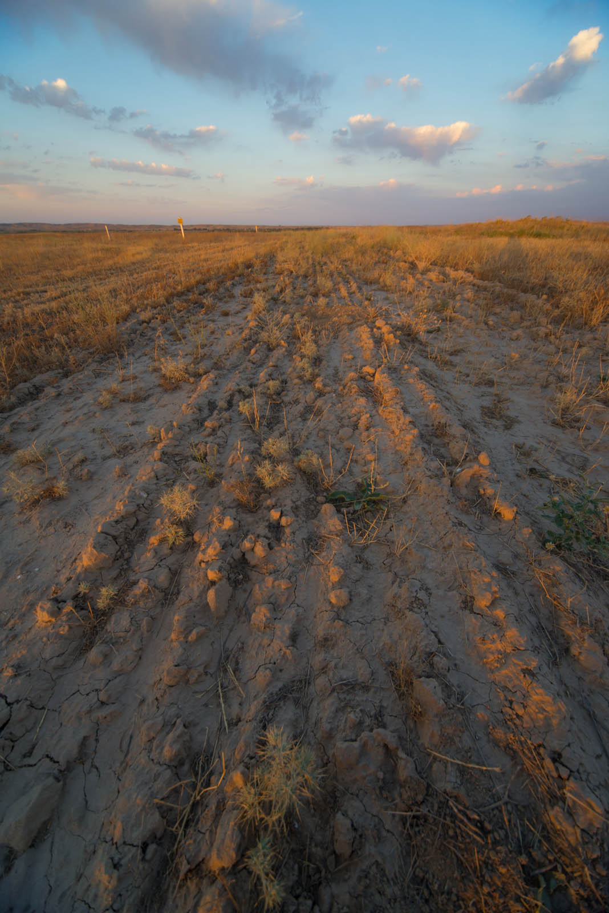
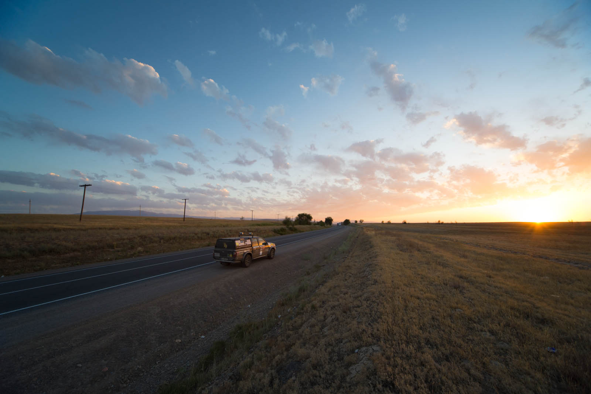
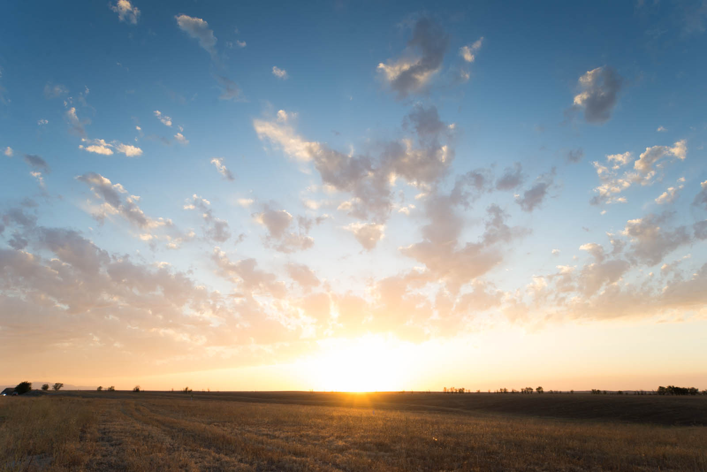
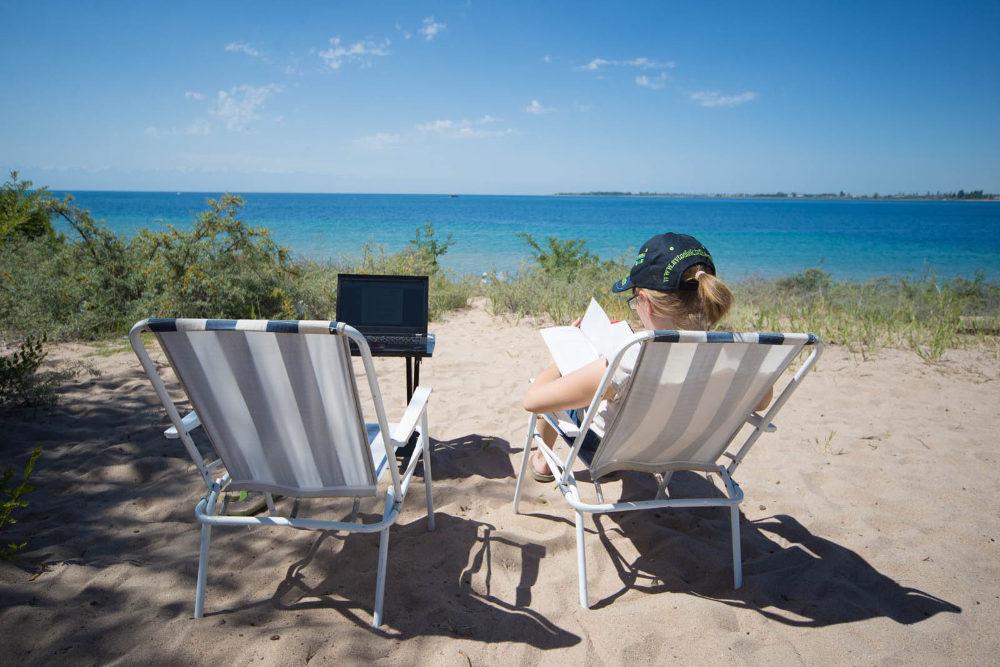
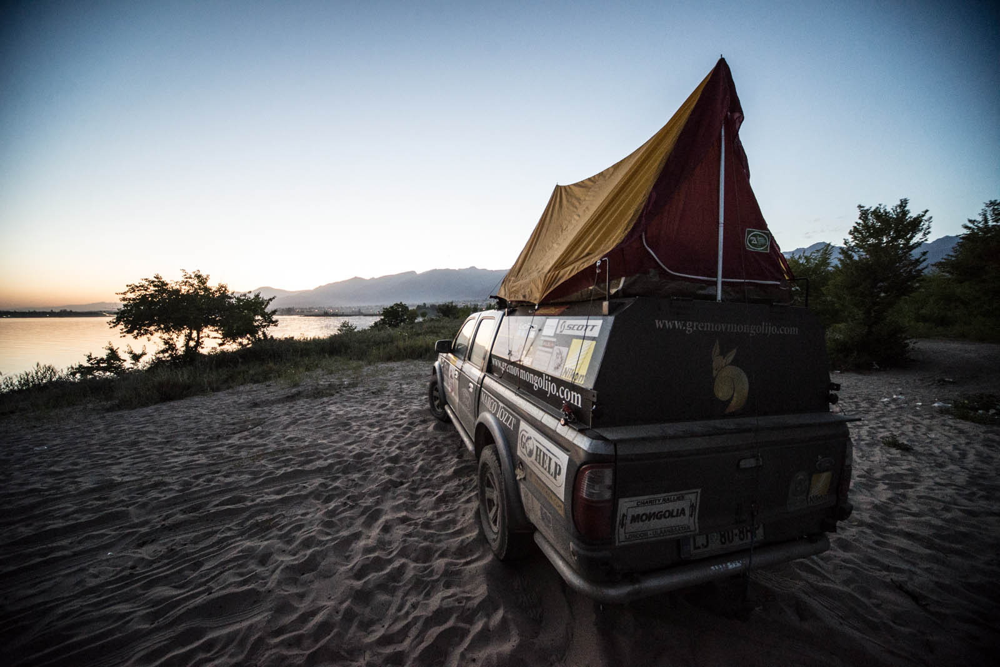
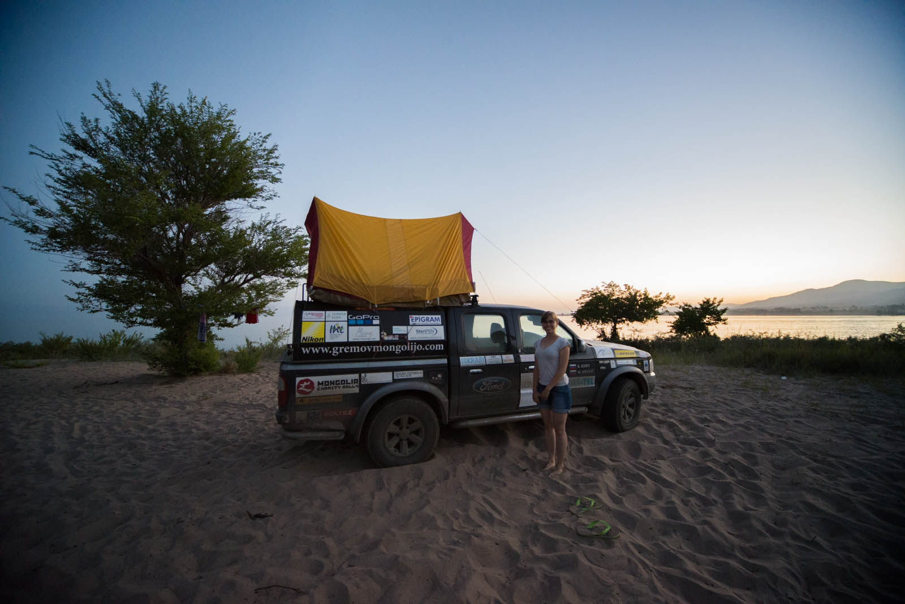

Zjutraj naju že ob 10. zmoti varnostnik hotela, češ da sva zaparkirala koše za smeti. Seveda ga zelo zanima, če je vse zaklenjeno (bog ne ve, če ne za lasten žep), midva pa počasi vstaneva in se odpraviva na ogled Biškeka. Mesto naju ne prepriča, veliko težavo imava z menjavo dolarskih bankovcev češ, da so poškodovani. Le dobiva tisto prgišče kirgiskih somov in kupiva kartice. Imajo nek čuden sistem za zalivanje trave v parku, ki se mu nasmejiva, podzemni prehod čez cestno pa izgleda kot neka slaba kopija kitajskega marketa. Odideva in se napotiva proti Issyk Kulu, baje drugemu največjemu jezeru na svetu po količini vode (in tudi med najglobljimi). Gibljeva se zelo visoko, saj je povprečna nadmorska višina Kirgizistana kar 2.700 metrov.

Matej se prebije iz mestnega centra, ustaviva se še v lokalnem marketu, nato pa se podava na 250km dolgo pot. Vmes se zamenjava in Katja bravurozno odvozi gorski odsek čez prelaze. Na večer prispeva v Chokpol-Ata, največje mesto na severni strani jezera.

Vse skozi naju spremlja neverjeten pogled na zasnežene gore Nebeškega gorovja in puščava na eni strani ceste, ter neskončna modrina in zasnežene gore na drugi strani. V lokalni trgovinici kupiva še nekaj stvari in predvsem vode, nato pa v tretjem poskusu najdeva peščeno plažo, kjer se odločiva prenočiti. Brez turističnih taks, brez urejenih sanitarij, samo midva, Žvau, voda in svoboda. Očitno tuka nikogar ne moti, če kdo prespi v avtomobilu, za WC zraven pa se plača nekaj evrov. Kampiranje kot tako še ni razvito, vsekakor tržna niša. Vrževa se v vodo, ki je malo mrzla, in slana – približno 1/3 slanosti Jadrana.

 Pisarna, kot nalašč za pisanje bloga.

Srečava še družino iz Biškeka, ki naju povabi k sebi domov. V zameno za nekaj somov seveda. Prijazno odkloniva in razprostreva palatko – šotor. Prvič, na avtu. Občudujeva sončni zahod, ki je fenomenalen. Gore in morje ob enem. Cela procedura, ki jo spremlja pikanje komarjev. Skočiva noter in ob 22.00 zaspiva.

Dobro uro in pol zatem naju prebudijo močne luči, usmerjene v avtomobil. Katja zapaničari in začne iskat pendrek, nato pa se le pomiri, ko ji potiho povem, da se pogovarjajo o avtomobilu in da so se verjetno prišli kopat. To se izkaže za resnično, požanjeva salve smeha na račun »glupih inostrancev« in odpeljejo se naprej, midva pa odsmrčiva še tistih nekaj uric, do jutra.
