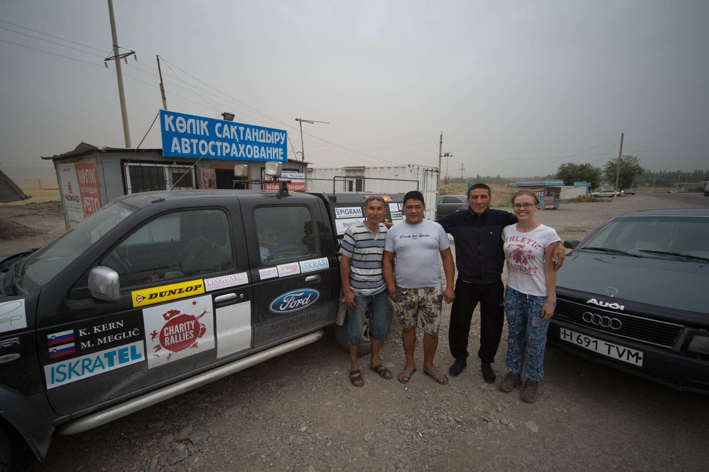

Na poti po zajtrk se čudiva količini policistov ob cesti. Na vsakem križišču minimalno eden. Tam, kjer običajno stoji na trume (nepravilno) parkiranih vozil, je danes cesta prazna. Kaj se dogaja? Izveva, da je Cholpon - Ata počitniška destinacija samega kirgizijskega predsednika in da urejajo promet, da bo lahko brez težav potoval. Verjetno naju je prišel pozdravit :).

Midva sva najin oddih zaključila, zato se vračava nazaj proti Kazahstanu. V parku se usedeva (poskrbiva, da imava razgled na cesto) in pojeva zajtrk. Ko se vrneva k avtomobilu in sva ravno na tem, da se odpeljeva, naju ustavi nek fant in nama podari sveže pečeno lepoško (kruh), se podpiše in fotografira z avtom.

In sva skupaj s Fordom nazaj na cestah. Te so lepše, kot v Kazahstanu, vendar imajo omejitve, ki ti parajo živce. V naselju neznosnih 40 km/h, izven naselja 80 km/h, nekje 90 km/h.  Našla sva manjši mejni prehod, kjer sva s kirgizijsko stranjo in žal brez predsednikovega pozdrava opravila v nekaj minutah. Kazahstanci so zahtevali nekaj več papirjev in ker so se obračali počasneje kot … (pustimo živalske primerjave)je vse skupaj vzelo dobrih 45 minut. Katja v rekordnem času dočaka Matejev prihod.

Vreme spominja na mini tajfun, veter piha in upogiba pločevinasto streho ter tistih nekaj dreves. Dež pa nese v vodoravni smeri, tako da sva ob prvem odpiranju okna cariniku, takoj mokra. Ker naju je zadnjič izučilo, takoj kupiva zavarovanje za avto, se registrirava kot voznika in seveda naju tokrat nihče ne ustavi. V zgodnjih večernih urah prideva do Alma-Ate, si poiščeva hostel in že tretjič v dnevu (tokrat ne zaradi dežja) stuširava.

Saj res! Ob izstopu iz Kirgizistana, je carinik zahteval  »podarek« in si prislužil majico Aerodroma Ljubljana.
