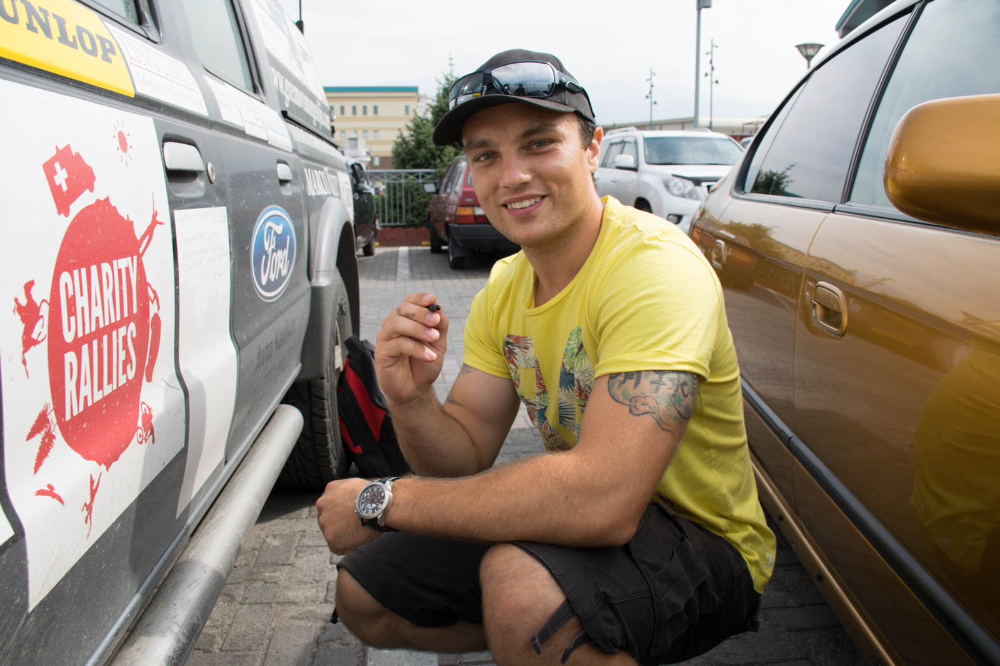
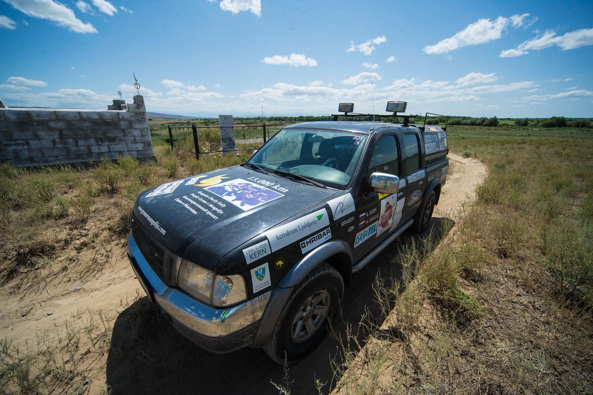

Najin načrt je bil iti iz Alma-Ate zgodaj zjutraj in se s polno hitrostjo odpraviti nazaj (oziroma naprej) proti Ruski meji. Pa sva večer prej, med izkoriščanjem interneta, dobila sporočilo. Pisal nama je Maks Selan, profesionalni hokejski igralec , ki je za dobro leto postal »Kazahstanec« (igra v HK Alma-Ata). Ker je v teh nekaj tisočakih, ki nas ločijo s Slovenijo, prav blagodejno slišati naše šumnike in dvojino, ter se seveda spoznati s (ker so na potovanju dobile razdalje drug pomen) sosedom iz Bohinja, je bila odločitev samoumevna. Še eno dopoldne ostaneva tu in zagrabiva tole veliko naključje. Dobimo se v nakupovalnem centru – MEGI, kjer počakava Maksa, da konča s prvim treningom.

Napaka. Katja, obkrožena s trgovinami pač ne vzdrži brez nakupa, pa tako je zatrjevala, da bo vse ostalo v Mongoliji. Ženske. V zagovor – bile so razprodaje;). No pa nazaj k srečanju. Ob vodi in čaju nam za dobre tri ure ne zmanjka besed. Midva kar ne nehava poročati dogodivščin in lepot s poti, izdava tistih nekaj slovenskih virov, ki trenutno tudi prebivajo v Kazahstanu. (To bo prava slovenska oaza :)) Maksu uspe, da ostaneva brez besed, ko nama pove o dosedanjem življenju v Stanu, predvsem sva osupla ob opisu dneva (beri: količine treningov) – kar mora biti logično, ker zadnjih dvajset dni samo sediva ;). Ampak od sedaj naprej spremljamo še Kazahstansko ligo in navijamo za Maksa! Pozno popoldne nama je le uspelo sesti za volan v upanju, da bova lahko prevozila čim dlje, brez postanka. To se ni izšlo popolnoma po načrtih. Kar nekaj grmov je doživelo najino intimno srečanje.

Tako je. Od danes nama delajo družbo prepečenec, jedilna čokolada in oglje. Ko se zvečeri in ko Katja po šestih urah vožnje in prevoženih 300 kilometrih obupa nad stanjem cest in trebuha, poiščeva najbližji motel, kjer sestaviva urnik za obisk toaletnih prostorov. Motel je svojevrstna izkušnja. Imava sobo v stilu glamurja, s kristalnim lestencem, usnjenim kavčem, zavesami iz bleščic … ni da ni. Poleg postelje je okno, ki je tik pod znakom, svetlečim se v zeleni, modri in rdeči barvi. In v teh barvah so to noč tudi najine sanje.
