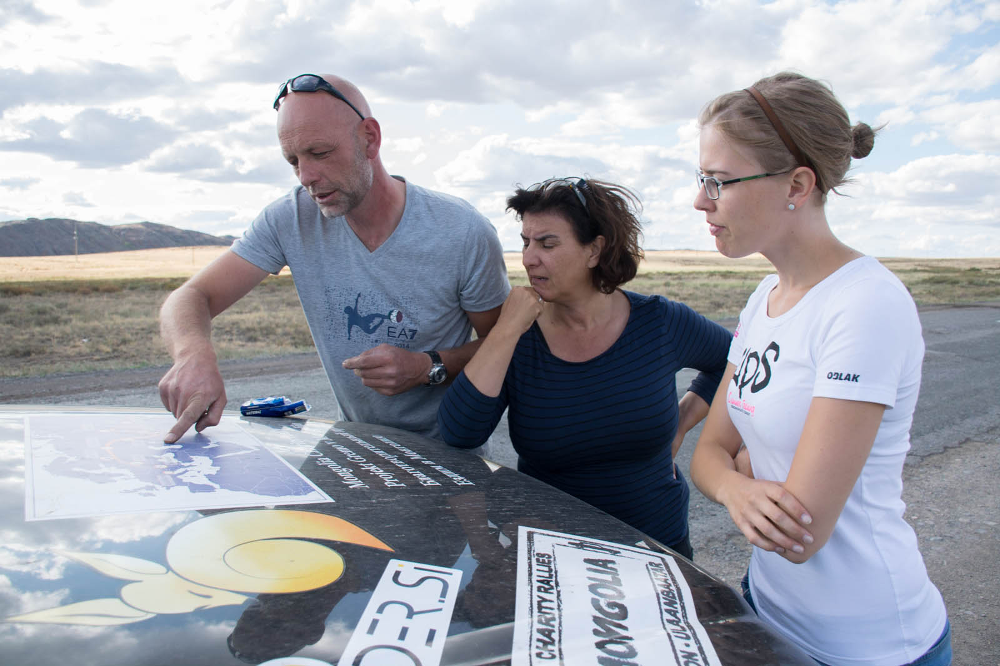
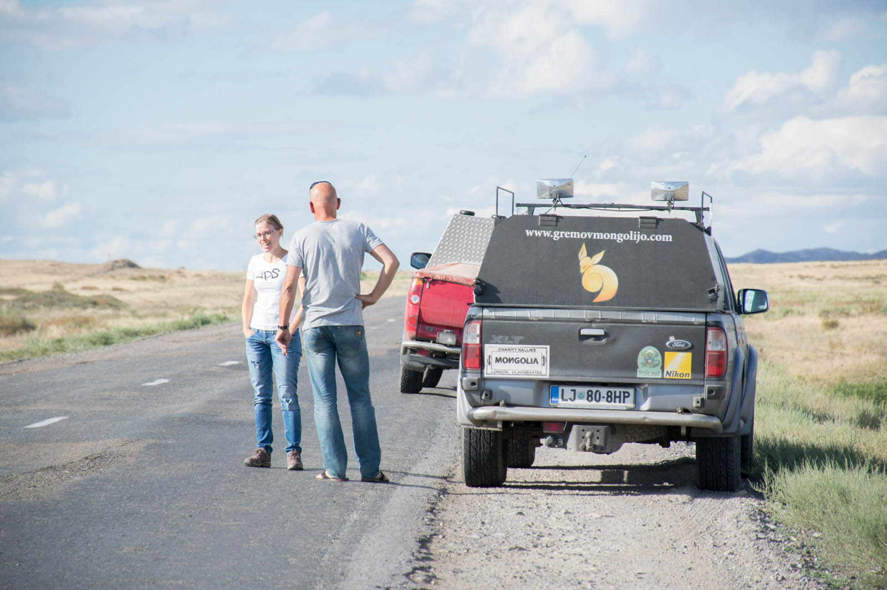

Zadnji dnevi interneta gredo k koncu, Mongolija je vse bliže. Zdravstvene težave nama ne pridejo do živega, tudi včerajšnji krepilen spanec in lekadoli nama pomagajo, da odrineva na današnjega tisočaka. Katja preizkusi srečo s cesto in po treh urah obupa, ker bojda vozi prepočasi in bi s tem tempom morala podaljšati čas potovanja. Naj glasni potnik na sovoznikovem sedežu upraviči svoje komentarje. In nič ne rečem – to tudi stori.

Prime za volan (off-roadarski položaj rok), nogo na gas in kar leti čez luknje. Luknja ob luknji, z luknjo v luknji. Groza. Raven stresa v tem dnevu se je drastično povečala, ker mi je v skrbi za avto, ki je nekajkrat pošteno zapeljal v cestno brezno, skoraj zastalo srce. Posnetek obrazne mimike pa bi bil zagotovo novi youtube hit. Ker sva si želela novih poznanstev, sva na nekem odseku zapeljala nekaj km/h prehitro in želja se nama je uresničila, družba pa je bila tako dobra, da sva zanjo plačala 10 000 teng. Ceniva, da si je policaj za naju vzel čas.

Med vožnjo je jezik skrbno pospravljen, ker naju trese, kaj trese, premetava. Ker veva, da morava jamranje podpreti z dokazi, se ob luknjah ustaviva in jih dokumentirava. Medtem, ko se sprehajava okoli lukenj kot forenzika in naju ostali soudeleženci prometa (verjetno upravičeno) čukasto gledajo, se ob nama ustavi rdeč, mitsubishi L200 (z vzdevkom Tomato). Registeracija nizozemska. »Oooo, turista!« ju pozdravi Matej. »Kam ste namenjeni?« »Imava isti cilj, kot vidva, le nalepk nama niso pravočasno poslali.« Oči nama padejo iz jamic. Malo preden sva se ustavila, mi Matej veselo razlaga, da po tej cesti se pa zagotovo še nihče iz rallya ni peljal. Aha. Ne moreva verjet. Koliko je možnosti, da sredi neskončnih kazahstanskih puščavski step srečaš ekipo, ki ima isto poletno poslanstvo?!

Kratek klepet in že sva nazaj na cestah, ker naju preganja tema. Opa. Smo nazaj na cestah, ker nas preganja tema. Odločimo se, da do Mongolije vozimo skupaj (Matej je še srečnejši in kolono dveh avtomobilov poimenuje kar konvoj:)). Govorimo le ob krajših postankih (še dobro, da bo v prihodnjih dneh dovolj časa za klepet, ker naju »matra firbec« o vsem :). Moški del ekipe poprime za volan in odpelje res zahteven teren. Ker je luč (beri:sonce) že davno ugasnila, si izmenjaje pomagata in utirata pot proti Eskemen, ker si najdemo prenočitev. P.s.:Tokrat sva drugič peljala na sistem, dokler bencina ne zmanjka in odvozila 536 kilometrov.

Bencin je res poceni. Matej tanka toliko, da ga ob polnem rezervoarju polije še po tleh – da bo zagotovo do vrha. P.s.II: Matej se s svojimi odličnimi ruskimi pogajalskimi sposobnostmi dogovori, da nam ceno prenočitve prepolovijo. P.s.III: Prevozili smo 1062 kilometrov.
