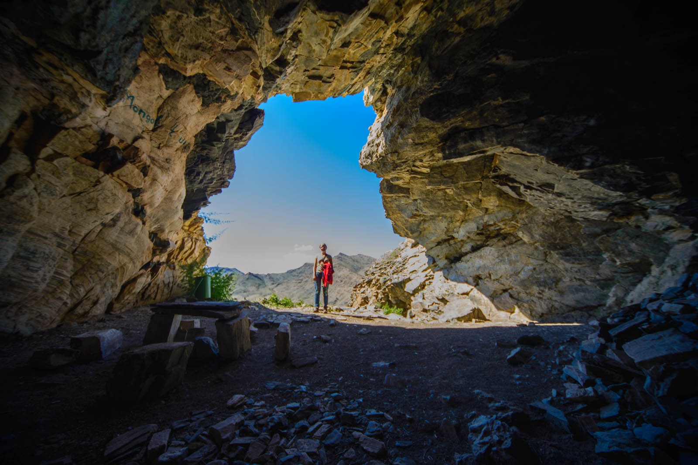

Kljub temu, da je jutro sveže in da se zbudimo relativno hitro, se komarji ne dajo. Še vedno čakajo na nas. Napravljeni kakor se da, pomijemo in pospravimo tiso, kar prejšnji dan ni bilo izvedljivo. Bojne rane so hude. Hugo ima v celoti popikan zadnji del vratu in roke. Česa takega pa še ne. Zajtrk je neizvedljiv, zato ga prestavimo v mesto. Najprej poiščemo še banko, kjer lahko zamenjamo denar. V mestu kar mrgoli ATMov (bankomatov). Preizkusili smo vse, vendar nobeden ne dela. Nekje je zmanjkalo denarja, drugi sploh ne obratuje. V bankah je še slabše. V mestu jih je cel ducat, a nihče ne želi slišati za menjavo. Pri naših zadnjih poizvedovanjih se le vdajo, a je velik problem kakovost bankovcev (morajo biti čisto novi in sprejemajo samo dolarje).

Poiščemo enega boljših hotelov, ki bi si pri nas z veliko težavo privoščil tri zvezdice. A imajo restavracijo in rahel signal Wi-fija in to je za nas dovolj. Spopademo se z nerazumevanjem menija (tokrat ni niti sličic) in le pridemo do skupnega jezika (lahko pa da je bila tudi samo sreča), s pomočjo vodiča, ki vsebuje majhen slovarček.  Zajtrk je kraljevski. Kruh z maslom in marmelado in ko pojemo to, nam prinesejo še omlete. Najemo se do stanja – komajsepremikam (za zajtrk odštejemo 13 €) in skočimo še v bližnjo trgovino, da se dobro založimo. Trgovina je majhna a ima vseeno kar nekaj izbire. Cela stran je sicer namenjena alkoholu in izpraznjene steklenice res pogosto vidiš tudi ob poteh.

Današnja začrtana pot nas vodi po poljih, kjer nas trese in premetava ob vseh kamnih in grbinah. Želimo doseči jame, ki jih vodič označuje kot vredne ogleda. Tja se prebijamo uro in pol, zračne linije 20 kilometrov, za pot nam služi tudi suha rečna struga. Podvig, ki je bil na robu naših zmogljivosti in ki  ga opravimo, ker več glav zna popraviti več stvari in lažje pokliče pomoč.

Avta pustimo na  praznem parkirišču, ki je narejenem iz kamenja. Table že dolgo ne dajejo potrebnih informacij. Mi,  polni upanja, da nas v jami čakajo jamske poslikave, zagrizemo v kolena in premagamo strm breg. Jama ima ob vhodu kamnito mizico in klopi, vendar vse pokrito v ptičjih iztrebkih. Seveda veliki misleci, pozabimo svetilke in Matej se hrabro žrtvuje in nabere dodatno kilometrino. Katja se s fotoaparatom poda v jamo in skuša s flešom pregnati temo. Nič. Na stenah so le grafiti in podpisi predhodnih obiskovalcev, vsepovsod je prah in nekaj ptičjih peres.

Preiščem čisto vsako luknjico jame, pregledam vse stene in ne najdem ničesar. Matej naznani, da je našel še eno pot, do druge višje jame. Jomina in Hugo obupata in gresta nazaj k avtu, midva se podava v jamo številka dve. Občutek nama govori, da bo polna poslikav in da bo upravičila strmo pot.

Tokrat Matej pogleda pod vsako skalo in razočarano ugotoviva, da tudi tu ni ničesar. Ker smo v Sloveniji imetniki tako osupljivega podzemlja, naju tudi velikost ne fascinira.

Vrneva se v dolino in najdeva najina »sokompanjona«  ob reki, ki skalnati pokrajini nudi pravo oazo. Tako je udobno, da se odločimo prespati kar tu. Sledi prvi »tuš« v Mongoliji, Matej se obrije in nihče se ne zmeni za tistih nekaj komarjih pikov, ki so cena rečne osvežitve. Sledi še večerja s katero so naši želodci zadovoljni čisto vsakič in spanec.
