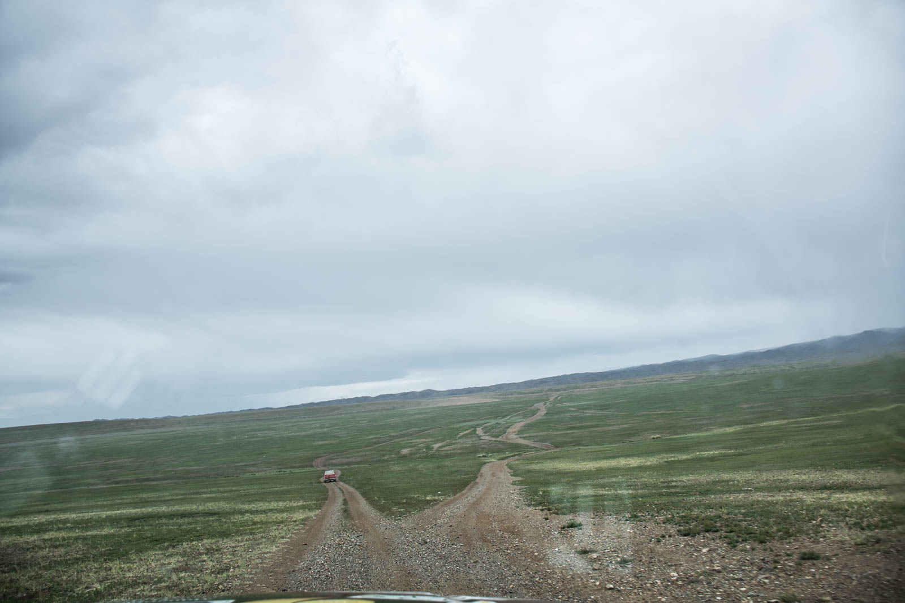

Iz našega skromnega zatočišča pri potočku smo se zjutraj odpravili Altaju naproti. Pa tokrat ne tistemu Altaju, gorovju, ampak mestu Altaj. Pozdravili smo orle, ki so se prebujali skupaj z nami, pobili tistih nekaj komarjev, ki jim je prav tako prišla na misel ideja, da bi potovali, nato pa se podali na pot.

Prevozili smo dolino, tokrat po drugi strani in kaj hitro prišli nazaj na asfalt. Ja, asfalt. Tale Mongolija ga pa serje. Naredijo ti čisto novo cesto, ne postavijo pa nobenega prometnega znaka. No, po nekaj obračanjih na sredi ceste se odločimo za pot in zastavimo. Omejitev 50, mi 120. Čez eno uro se ustavimo ob gozdiču, nad katerim krožijo orli, cela jata jih je. Nato nadaljujemo in nekje 40km pred mestom Darvi asfalta zmanjka, kar tako, nato pa po makedamu naprej. V mestu natočimo gorivo, bolj zato, ker upoštevamo nasvete slovenskih offroaderjev Igorja in Aleša, da vedno točiš, ko vidiš pumpo. Kako pametna odločitev. Podamo se naprej in … pademo v Gobi.

Ja, puščava spreminja svoj izgled vsakih nekaj kilometrov, od prostrane stepe do grmičevja in samega kamenja. Prav tako se spreminja način vožnje, enkrat drsimo napočez, spet čez 10min se avtomobil trudi s preveč polnimi pnevmatikami po pesku, skorajda mivki. Seveda enkrat okrog naju ni nič, drugič pa se prebijava za 300 višinskih metrov gor in dol po rečnih strugah, na srečo suhih.

Nizozemca ne zaostajata, zato si na prelazu privoščimo hitro kosilo, 300 metrov stran pa se pase čreda kamel, čisto divjih. Nič kaj dosti se ne zmenijo za nas, mi pa ne za njih. Obkrožimo Ovoo in zdrvimo naprej v dolino. Nor spust, ki sva ga upava da skoraj celega ujela na kamero – hitrost med 40 in 60 km/h, tereni pa vsi, razen asfalta. Katji postane slabo, zato je vožnja čez planjavo v zahajajočem soncu nekaj povsem drugega. Zvečer dosežemo mesto Jargalantin tam povprašamo za smer. Zemljevid se bliža koncu, zato se zadovoljimo z napotki in se odpravimo na jug, ne na vzhod. Ustavimo se še ob svetišču in se nato zapodimo v hribe, ampak kaj kmalu že vžigamo avto na kable. Na srečo ne našega. Misija uspešno opravljena, Buda bo ponosen.

Katji postane slabo do konca in na hitro sklenemo, da prenočimo v avtomobilih, na planjavi 50km pred Altajem. Lahko bi vzeli tudi boljšo (asfaltirano) cesto in bili tam v 2-3 urah, ampak smo srečni, ker nam toliko različnih krajin narava ni nudila že kar nekaj časa. Sončni zahod fenomenalen, vložene klobase pa prav tako.
