Po jutranji kavi, ko se spalnica spremeni nazaj v avto, se odpravimo v mesto Bayankhongor. Mesta imajo tu čisto drugačno podobo. Ja, imajo tiste osnovne sestavine mesta, kot so šola, banka, trgovina in pošta, obdajajo pa jih majhne hiše z barvastimi strehami in geri, obdani z ogradami. Najdemo prvo bencinsko črpalko, dolijemo manjkajoči dizel. Ker dežuje se odpravimo v najboljši hotel v mestu na kosilo. No, hotel še zdaleč nima tipičnega razkošja petih zvezdic, ima pa odličen ocvrt krompirček in pomarančni sok.

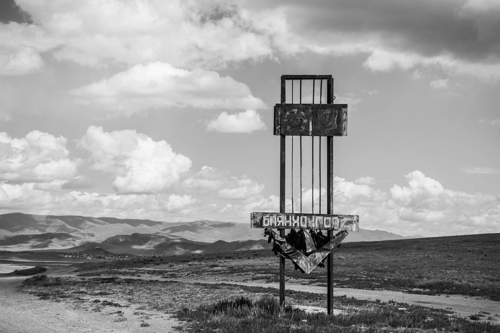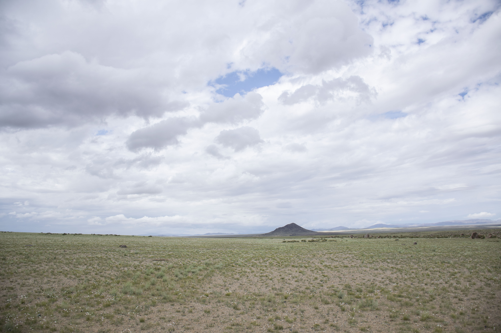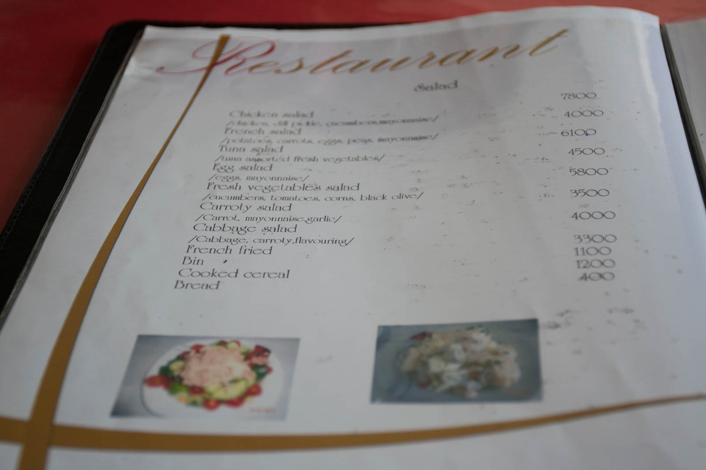 French fried ali Ocvrti francoz. 

Na zemljevidu smo odkrili, da se v bližini mesta skrivajo vroči vrelci. Zagotovo to niso toplice, a vode se vsekakor ne bomo branili. Po dolgem iskanju poti, obračanju, ker je tok reke premočan, da bi jo prečkali in plačevanju cestnine za nekaj kilometrov asfaltne ceste (ki že kaže dotrajanost in posledice zime), se le vdamo in se odpeljemo proti naslednjem mestu Arvaikheer. Ideje o toplicah še vedno ne opustimo, ker zemljevid kaže, da so vrelci tudi v bližini nove destinacije. Cesta je asfaltirana, a se velikokrat bolj izplača voziti ob njej, ker ima preveliko lukenj. Izgleda, da za ceste nihče ne skrbi, po tem, ko so postavljene, čakajo svoj bridki konec.

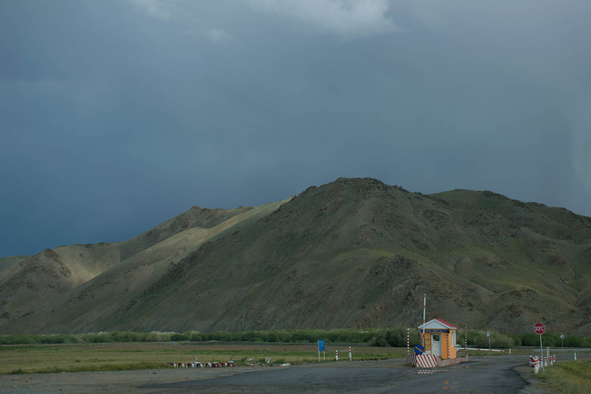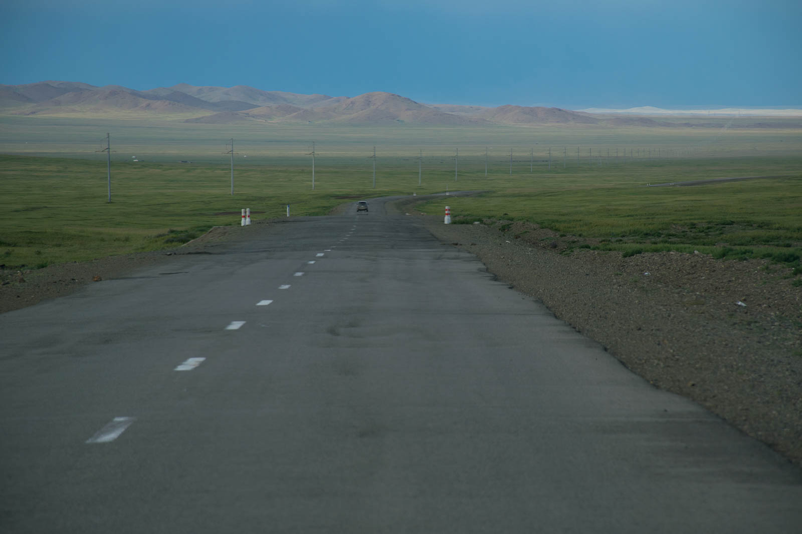

Malo pred mestom zagledamo veliko ogrado, v njej pa nekakšne polkrožno postavljene stebre, ki dajejo vtis templja. Ob strani so postavljeni kipi konjev, v atriju je postavljen še en, najmogočnejši kip konja, za njim pa kip Bude. Plačamo vstopnino (500 chinggis) in si ogledamo  mogočno znamenitost, ki je prva večja, odkar smo prišli v Mongolijo. Ograjo prepletajo modri šali, okoli bude je zbrana vsa mogoča »šara«, ki služi kot poklon. Od vodke, piškotov, kruha, denarja, plastenk s sokom, slik, ni da ni. Po travi skače nešteto mišk, ki skačejo iz luknje v luknjo in se igrajo med polkrožno postavljenimi konjskimi lobanjami. Za »templjem« je častno pokopališče konjev. (Edino konja, ki je res slaven, pokoljejo v celoti.)

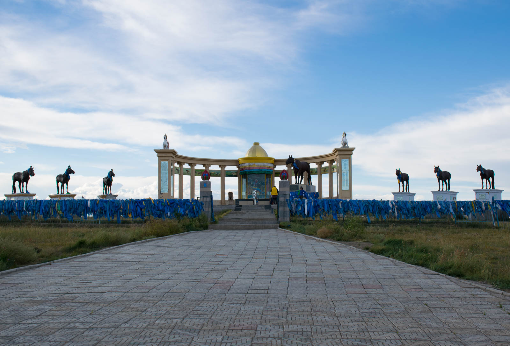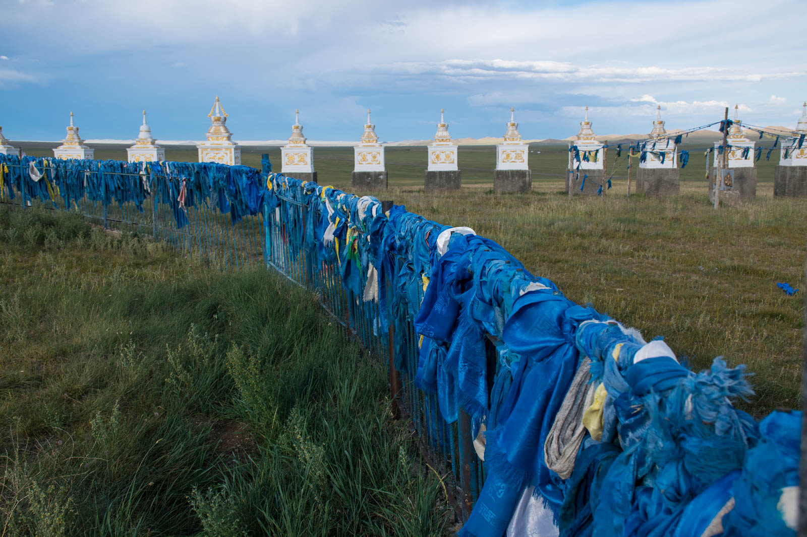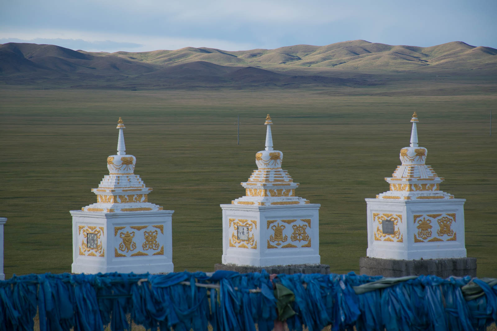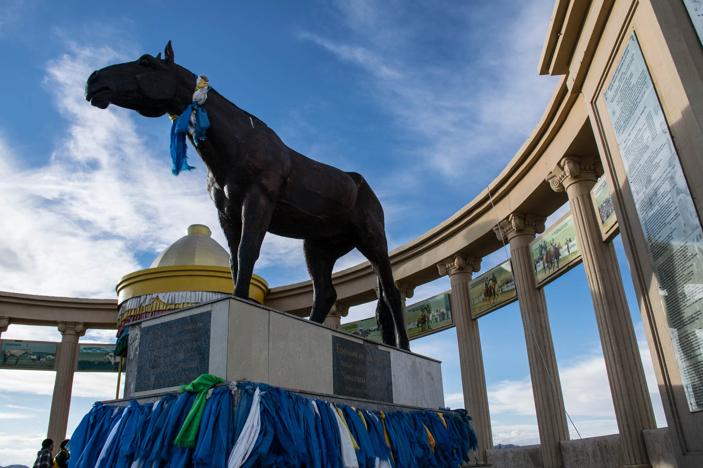

Makedamska cesta nas vodi naprej po dolini, do Taragta. Mesto je res majhno, a očitno dovolj veliko, da imajo na sredi 200 metrov asfaltirane ceste. Ker o naših vročih vrelcih ni ne duha ne sluha, se parkiramo v zavetrje nekega hriba, ki je pokrit z nekimi zelišči, ki nadomeščajo travo. Oddajajo pa čudovito aromo, ki nam odišavlja današnji tabor.

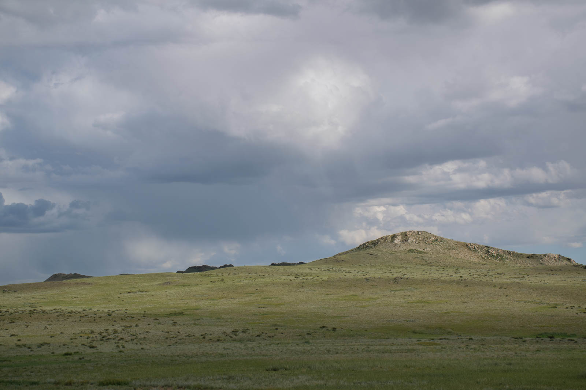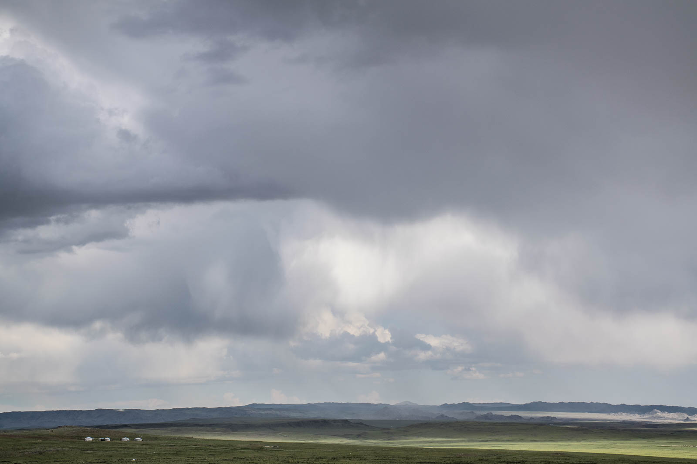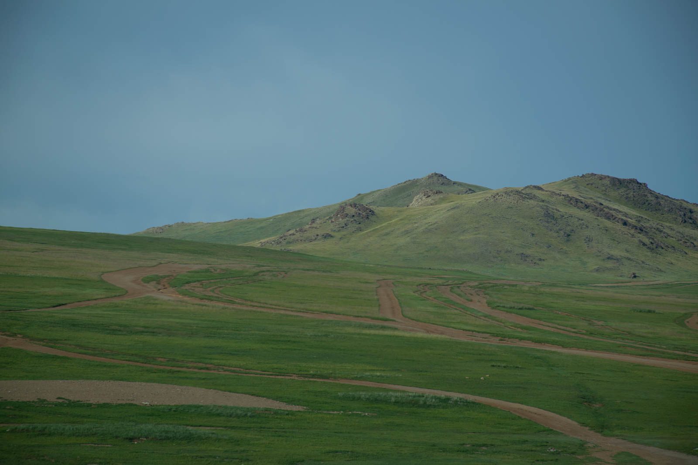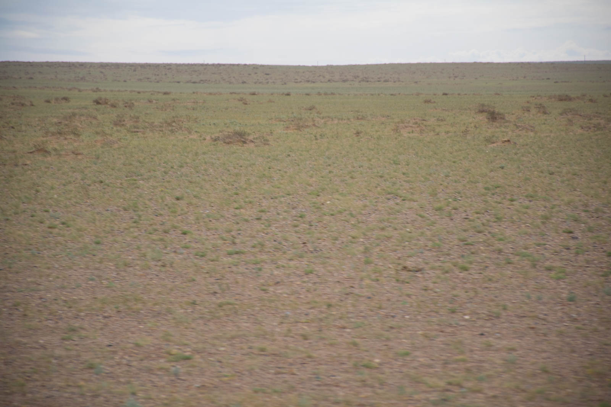

P.s.: Tresljaji mongolskih »cest« so tako veliki, da je dnevno potrebno »zašraufat« vse matice v avtu, nekaj vijakov pa je popolnoma obglodanih. Avto, v jutranji pozdrav, puhne črn dim.

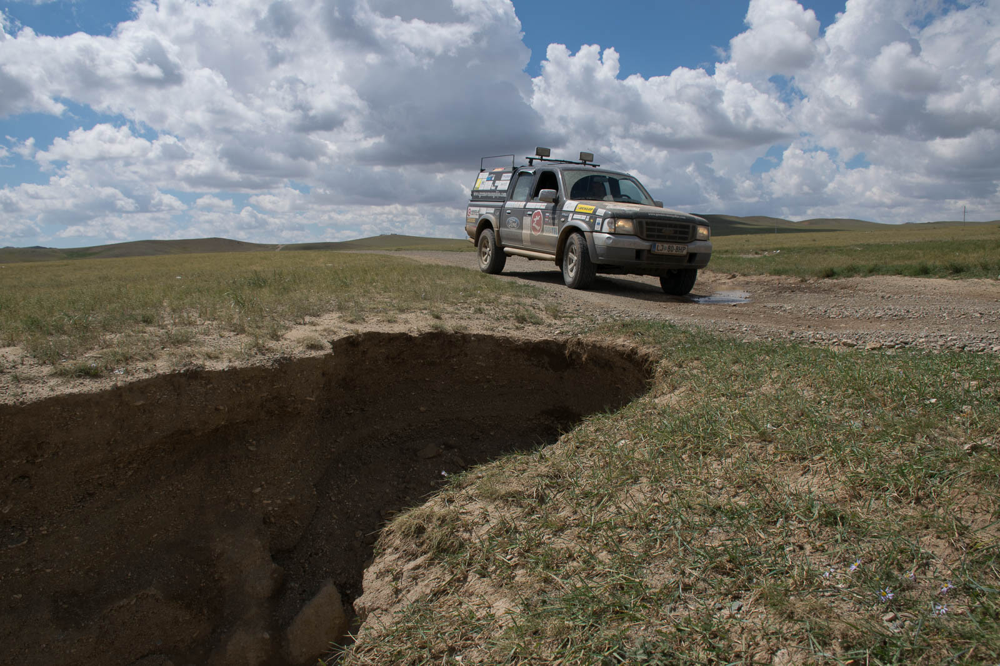 Luknje brez opozorila so nekaj čisto običajnega.
