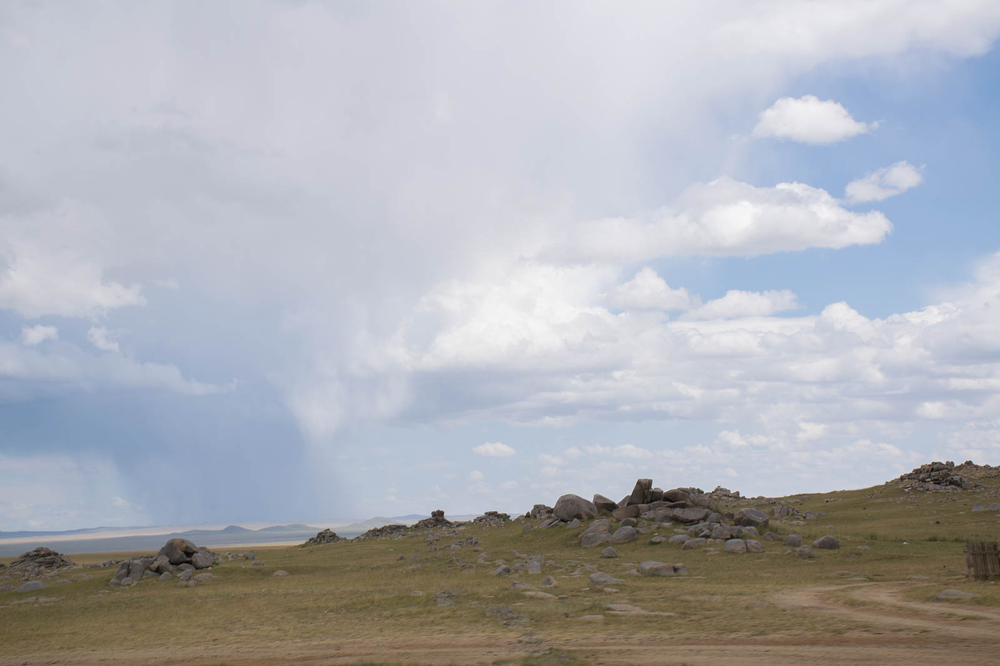
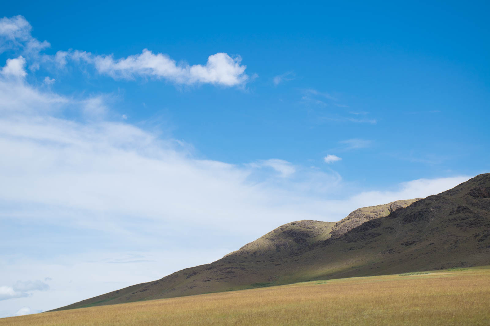
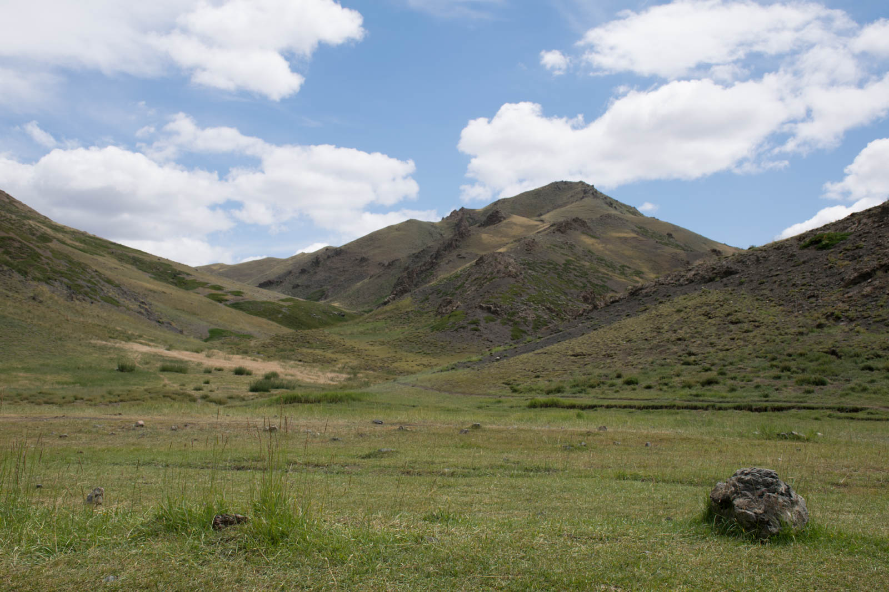
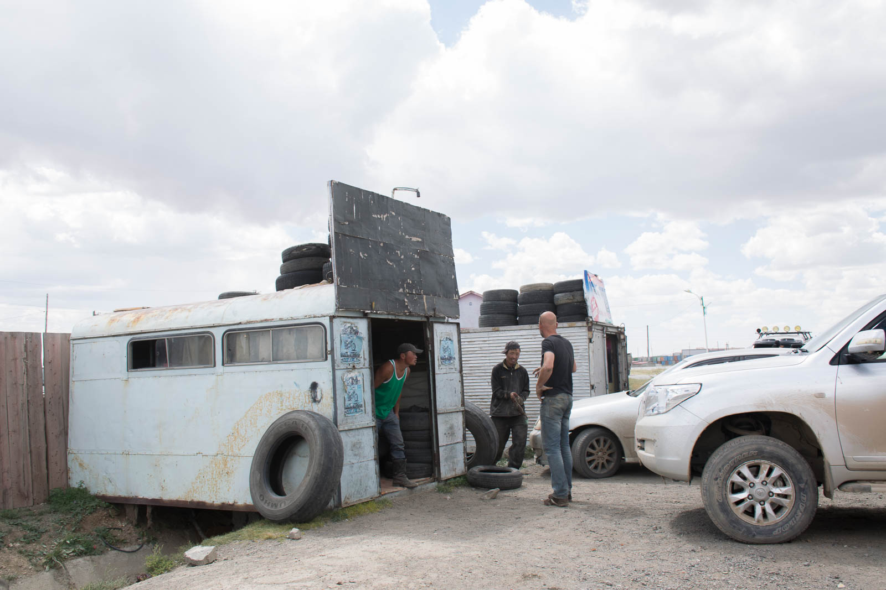
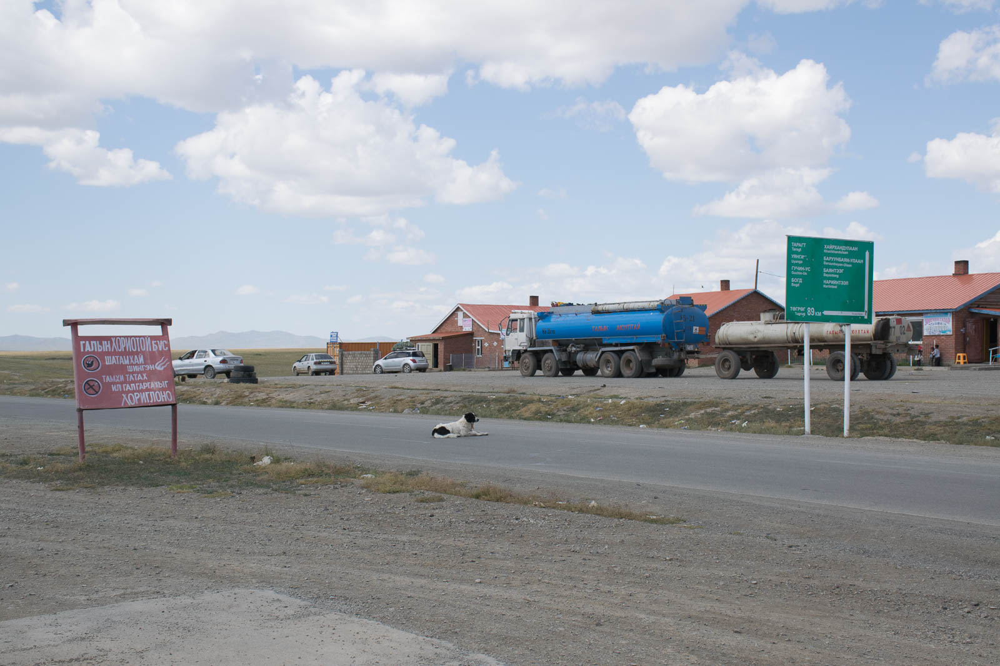
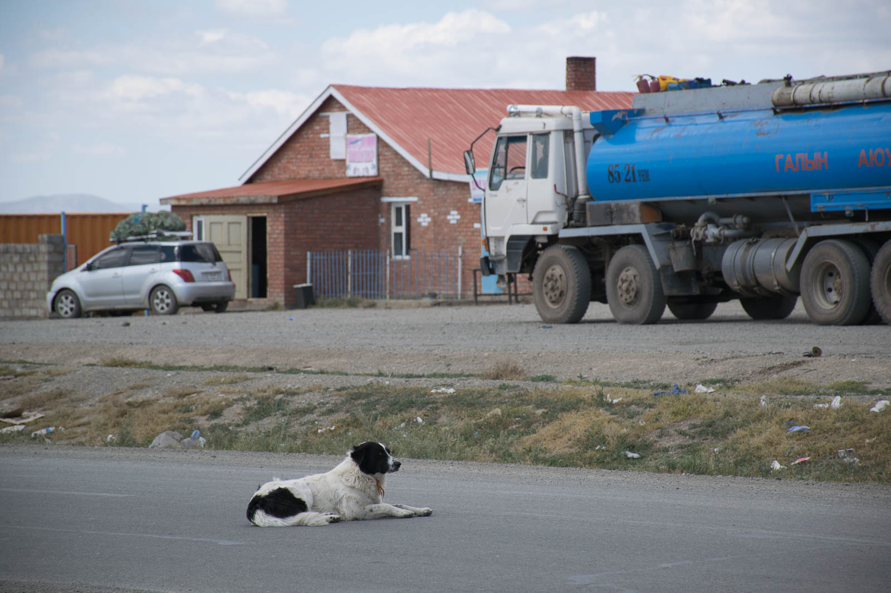
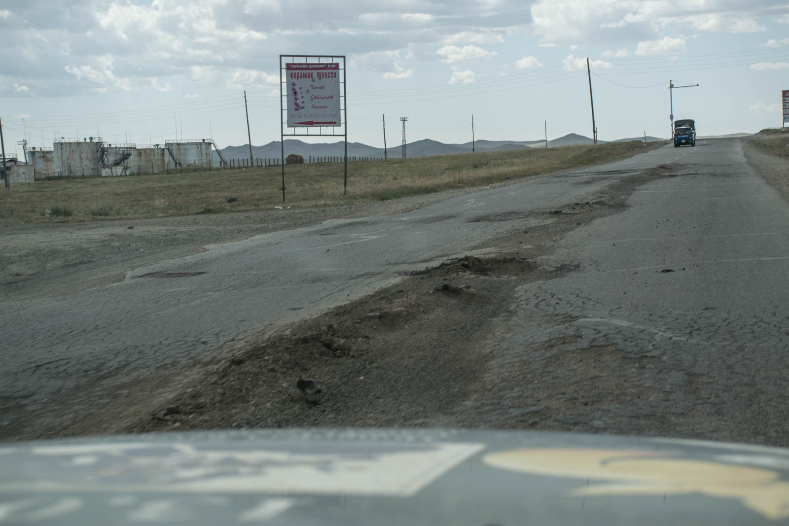
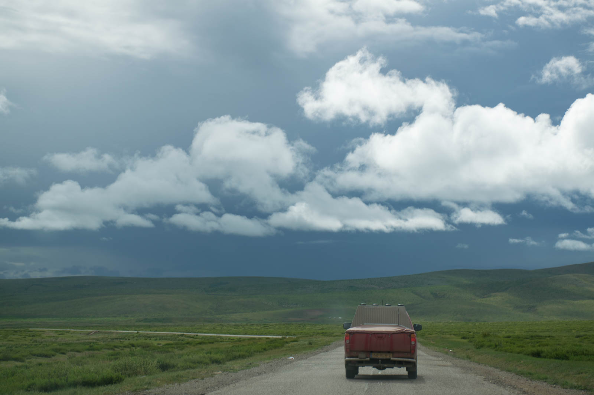
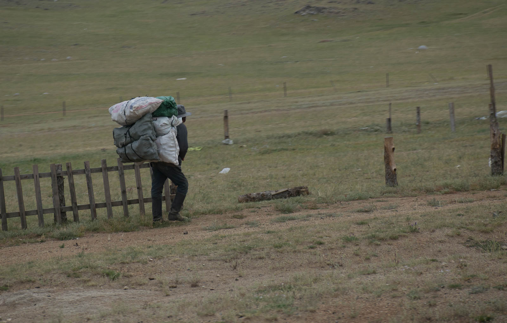
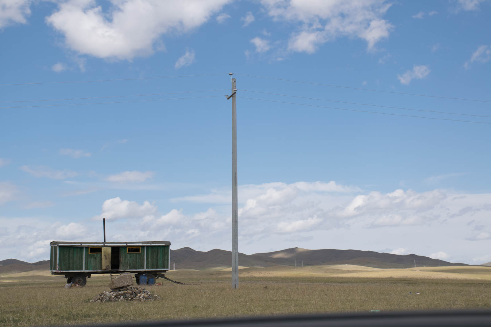

Potovanje v skupini oziroma tukaj gre bolj za par (govorim o avtomobilih), je v veliko olajšanje, ker  veš, da v primeru okvare ne bo potrebno čakati na naslednjega mimovozečega,  plus še ena izkušena mehanična moška roka je zagotovljena, kar je (roko na srce) veliko bolj uporabno od sovoznice (ki sicer zelo dobro kuha :)). Ravno zato si lahko privoščimo še kakšen off-road več.

Odpravimo se iz Taragte in naspani skačemo po poljskih luknjah. Danes poti utira Matej. Naenkrat v bočnem ogledalu ni ne duha ne sluha o rdečem paradižniku (vzdevek drugega avta). Nekaj časa se še voziva, ko pa rdečega zasledovalca še vedno ni, obrneva in ga poiščeva. Čaka naju na makedamski poti, pod njim leži Hugo. To ne more biti dobro. Prve domneve o okvari so za Mitsubishija usodne in samo upamo, da se motimo.

Odpeljemo še nekaj kilometrov in na zapuščeni bencinski črpalki ugotovimo vzrok ropota. Na amortizerju se je zlomil list. Avto se še vedno lahko vozi, a povzroča ropot, ki se ga sliši daleč naokoli. Še dobro, da smo blizu Arvayheera, kjer obiščemo štiri mehanike, ki nas v mongolščini odslovijo, ker nimajo potrebnega nadomestnega dela. Ker Jomina in Hugo iz centralne Azije odhajata nekaj dni pred nama, midva pa si zelo želiva ogledat še jug države, smo sprva mislili, da se bodo naše poti ločile. A prijateljev se ne pusti v težavah, zato skleneva, da prilagodiva pot in pospremiva soudeleženca projekta v Ulaanbaatar in potem kreneva proti jugu.

Cesta niti ni tako slaba in prav zato je še težje voziti 60 km/h – ampak pravijo, da se počasi daleč pride :). Gre nam celo tako dobro, da sprejmemo sklep o mini izletu v Harahorin (Karakorum), bivšo prestolnico še iz časov Mongolskega imperija (ki se je nato prestavila v Peking). Dodatnih 75 kilometrov nam pa ja ne more škoditi. Da vsakdo kdaj sprejme napačno odločitev se zavemo, ko se naša potovalna hitrost upočasni na 40 km/h, zaradi podlage. Ne moreš se odločiti ali je to asfalt z luknjami ali luknje z nekaj asfalta.

Ker se že večeri, si poiščemo prenočišče (za spremembo) v kampu, ki ponuja prenočitev v geru. Lastnik kampa je veliki zmagovalec  mongolskega suma, o čemer pričajo tudi fotografije na  stenah restavracije. Ker je glavni kuhar za nekaj časa odšel iz mesta, nam mongolske jedi pripravi njegova namestnica, ki se pri tem zelo izkaže.

Ko se odpravimo spat, pa Katja naredi strašno napako. Prižge luč v geru (kar je prava umetnost) in na postelji odkrije dva pajka. Nič groznega si misli in Mateja poprosi, da ju pospremi iz gera.  Obrne se – hm, tudi tam je pajek. Pogleda proti stropu … pajek tu, pajek tam… dihaj…aaa to je celo gnezdišče! V hipu se odločim, da grem spat v avto, ne glede na vse. Spanju v avtu se pridružijo še vsi ostali, tudi veseli, ker jim ne bo potrebno prenočevati z dolgonogimi prijatelji. (V zagovor, res so bili veliki!!!)
