Preden odrinemo nazaj proti Ulaanbaatarju, si želimo ogledat Erdene ZuuKhiid.  Počakati moramo, da se Mongolci prebudijo, zato si kar pred ogrado privoščimo zajtrk. V jutranji pozdrav meka in muka tudi mimoidoča čreda. Ko kazalec pokaže devetko, je čas za ogled znamenitosti. In nismo prvi. Prvi mongolski tempelj si želi videti nemalo število ljudi (domačinov, tujcev), ki pridejo sem iz radovednosti ali pa molit. In stvar je res velika. Znotraj ograde (v katero je vgrajeno 108 stup) stoji nekaj templjev, ki se jim je uspelo izogniti uničenju (prvotno jih je bilo med 60-100). Vsem se pozna sled časa, a z nekaj domišljije, si lahko pričaraš pompoznost kraja.

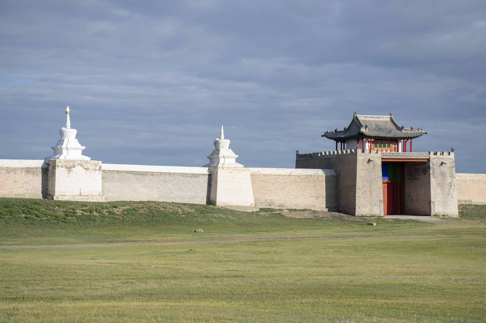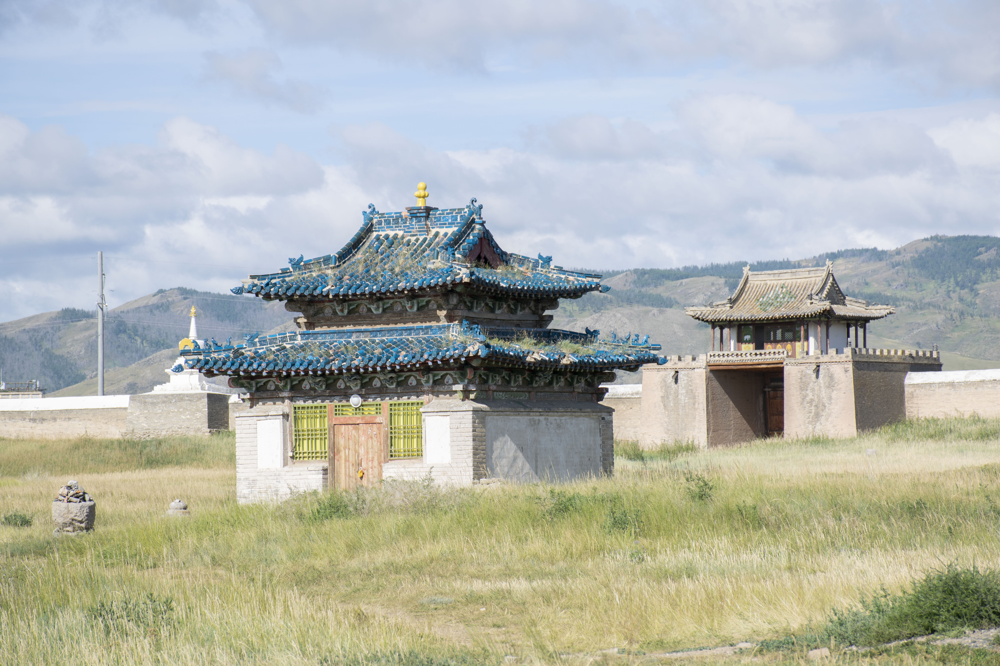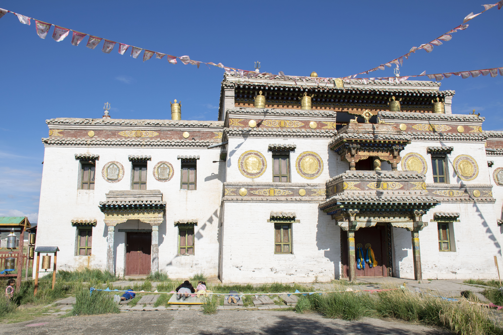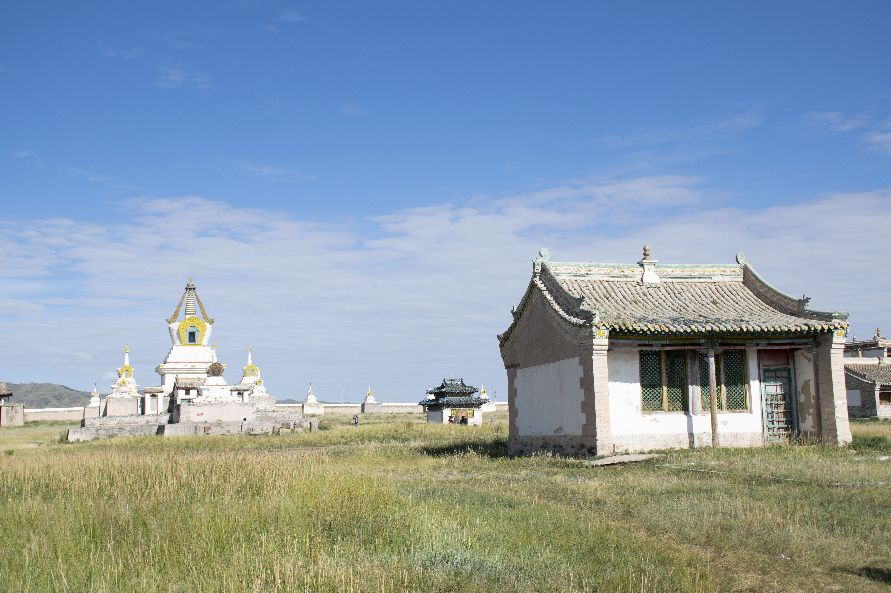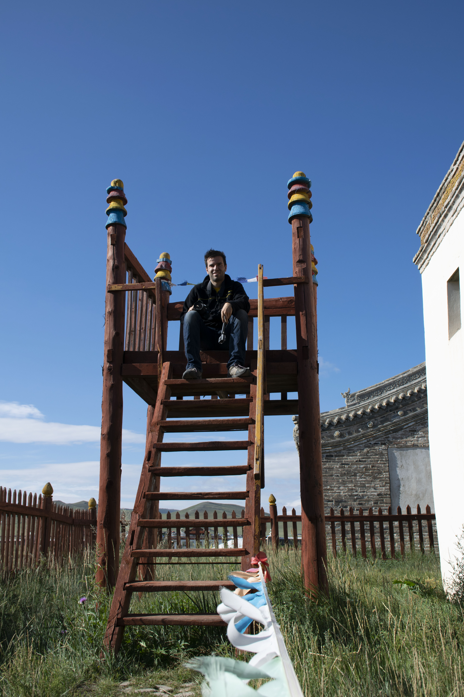 
Lovska opazovalnica

Templji so iz različnih krajev. En je posvečen Budi oziroma njegovim trem življenjskim obdobjem,  drugi je tibetanski tempelj in ljudje tudi danes molijo pred njim in vrtijo »zlate« valje v katerih so zapisi oziroma molitve (ko valj zavrtiš, to velja kot molitev). Na trgu se na tleh poznajo temelji gromozanskega gera, ki je bil postavljen v obeležitev Zanabazarjevega (arhitekt) rojstnega dne. Nismo pa našli oziroma smo pozabili iskati želve, ki stojijo kot varuhi mesta in upodabljajo večnost.

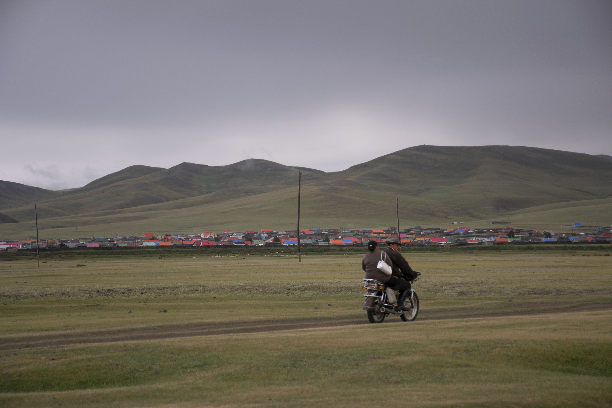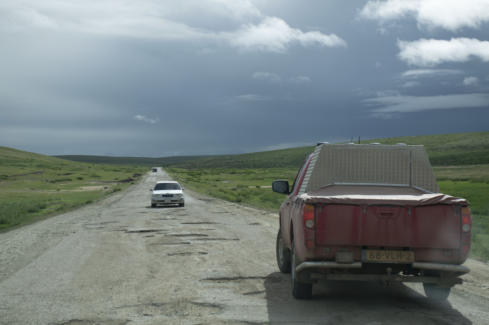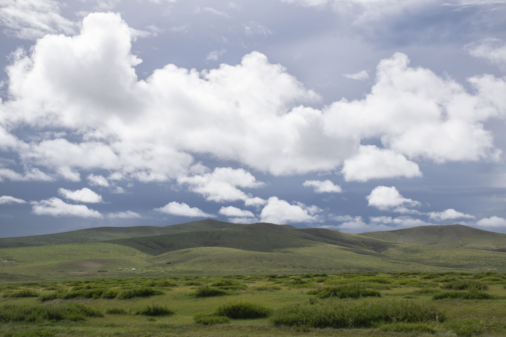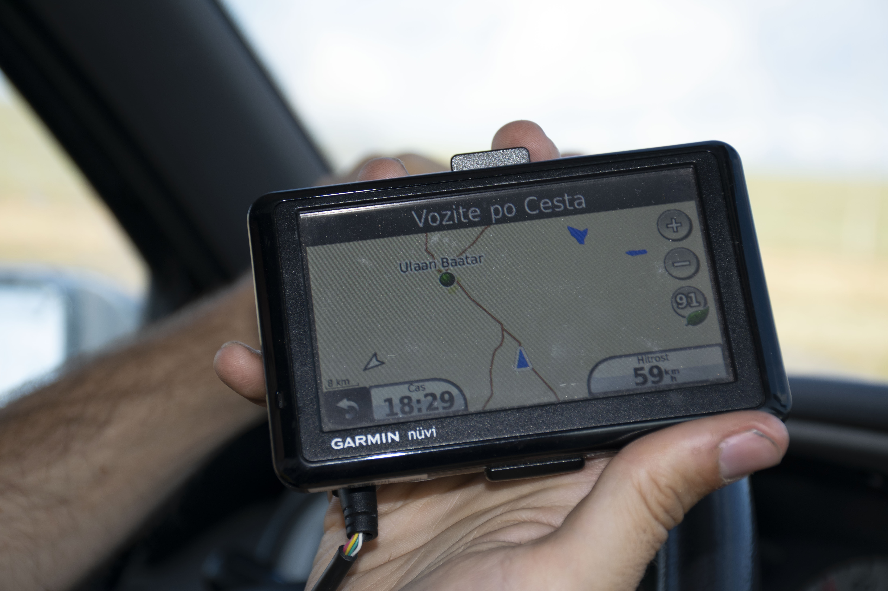

Ulaanbaatar nas že čaka. Po dobrih štirih urah počasne vožnje in kosilu ob cesti, smo dosegli naš cilj. Midva zelo predčasno. Si pa vseeno ogledava teren. :) Ker je asfalt malo boljši, je prva stvar plačevanje cestnine. Pogled v poseljeno dolino razblini vsa pričakovanja (no v resnici niti nisva vedela kaj pričakovati). Zdi se, da so vsi naseljeni tu. Nekaj industrijskih dimnikov, ogromno stolpnic (veliko še v gradnji), na obrobju pa griči poseljeni z nizkimi hiškami in geri. Pravo »mravljišče«. Vse leži povsod, nobenega pravega reda.  Do sedaj smo bili skoraj edini na cesti, zato je vožnja v prometni konici pravi šok. Med prebijanjem opazimo znak sorodne organizacije Mongol Rally, ki podobno kot Mongol Charity Rally organizira mongolsko dogodivščino, le da avto ostane lastnikom (imajo določene kriterije, da je vse skupaj še bolj zanimivo: največ 1.0 motor, avto v vrednosti ne več kot 500 €, vseeno pa se zbira denar, s katerim vsako leto odprejo eno izmed organizacij (letos je to Cool Earth).Parkirišče imenujejo kar pokopališče in ko vidimo vse mogoče vrste vozil in slišimo zgodbe, ki stojijo za potovanjem, nam oči že skoraj padejo iz jamic.

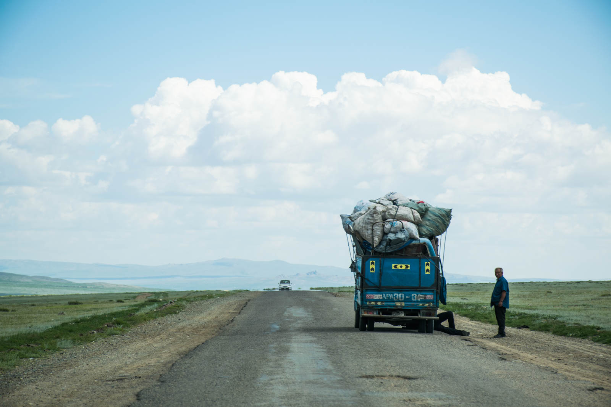

Med iskanjem prenočitve se izgubimo in prečešemo ulice od tistih svetlečih, ki jih krasijo bogate izložbe, do mnogo številčnejšega »geta«. V mestu se res najde vse stvari. Če ne drugega je vsak drugi zabojnik menjalnica gum. Uspešno najdemo toplo vodo in mehko ležišče ... kaj bi si še lahko želeli. 

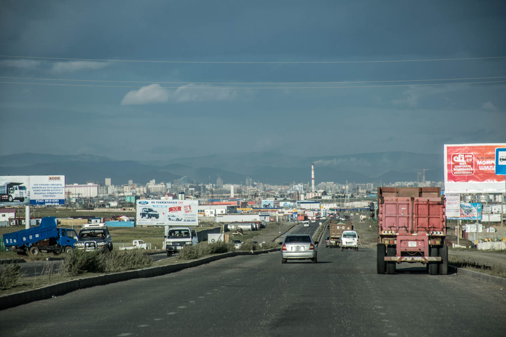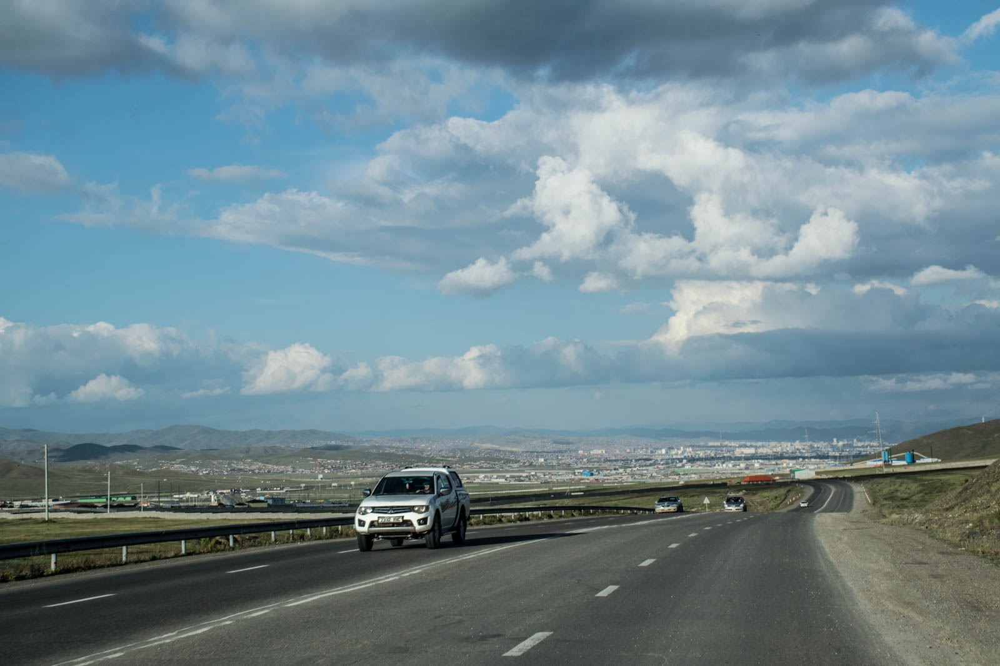
