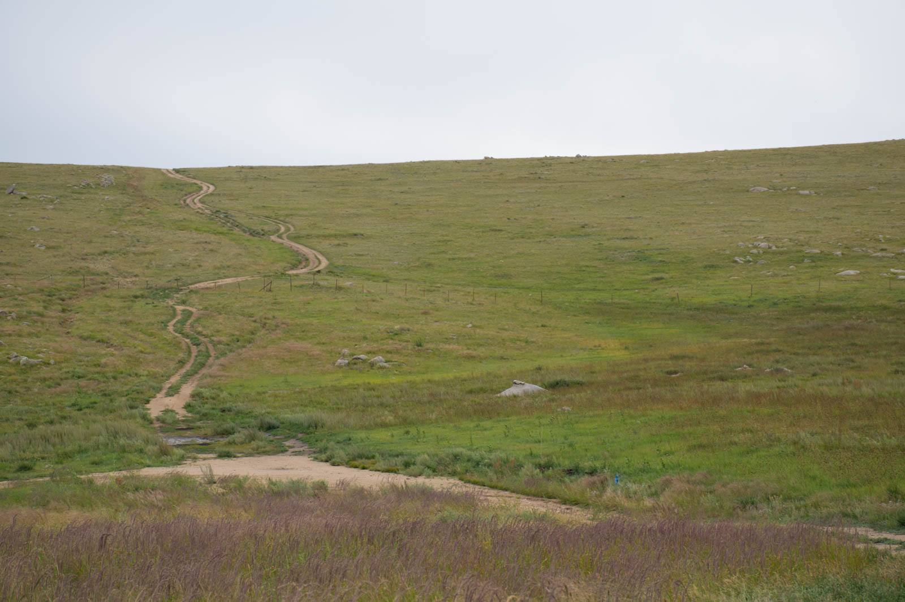
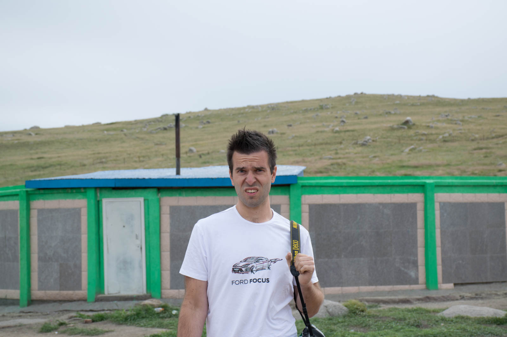
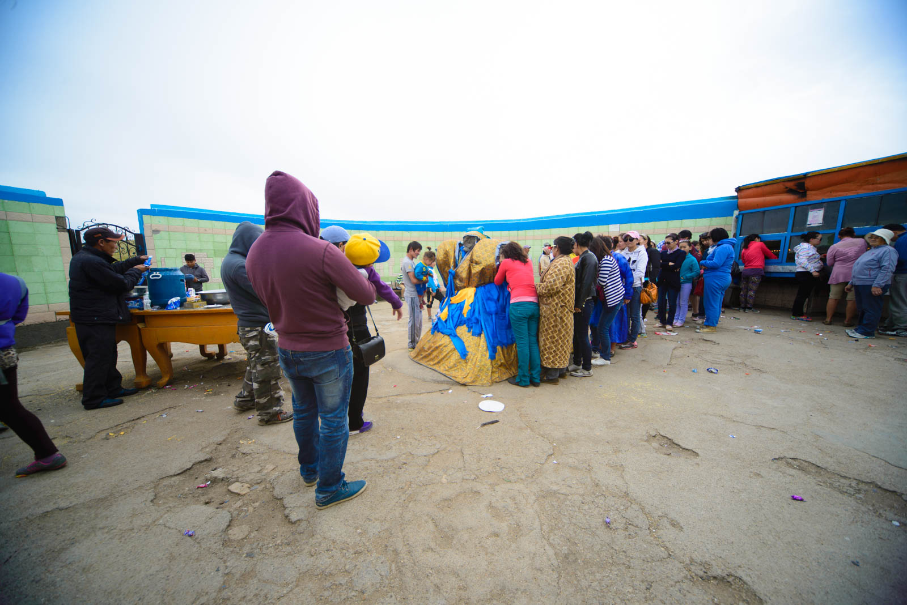

Po zajtrku prvakov se takoj prelevimo v tipične turiste, vsak s svojim fotoaparatom okoli vratu. Odločimo se, da bo Mitsubishi počival in da gremo s Fordom. Premečeva vse stvari z zadnjih sedežev in skupaj se odpeljemo pogledat zanimivosti, ki so v okolici mesta.

 

Naša prva tarča je kip Chinggis Khaana. Najdemo ga 40 kilometrov ven iz Ulaana, med Nalaikhom in Erdene (seveda ne gre brez napotkov domačinov, ker bi v edinem razcepu izbrali napačnega). No v bistvu kipa ne gre ravno zgrešiti, ker je to 40 metrov visok, srebrn možak na svojem konju. Tu so ga postavili v letu 2008, ker naj bi na tem mestu po legendi našel zlati bič. V notranjosti smo si ogledali dve ekshibiciji o zgodovini, ponosu Mongolskega imperija in njihovega heroja Chiggis Khaana, gromozanski čevelj (ki je prišel v Guinnessovo knjigo rekordov) in se povzpeli na glavo konja, ki nudi panoramski razgled. Kaj naj dodam … Zelo zanimivo, vendar žalostno, da je v 6-tih letih vse uničeno, robovi odkrušeni in vse skupaj narejeno zelo z levo roko. Žal se zgodovina življenja v šotorih pozna tudi pri današnji arhitekturi.

 V muzeju imajo tudi največji čevelj, številka noge 12000.

Odpeljemo se nazaj v Ulaan in nato na jug proti Mother Rock (Eej Khad). Gre za skalo v obliki človeškega telesa, ki naj bi simbolizirala žensko telo, še v času, ko je bilo 100kg nekaj normalnega. Vse lepo in prav, ampak ta svetinja leži 60km iz Ulaana, do tja se voziš 2 uri, če imaš srečo, in se vmes vsaj dvakrat izgubiš. No, vsaj mi smo se. Mama Skala ni za nas, kiča vajene Evropejce nič posebnega, kamen, pri katerem molijo ženske, ko pač pridejo na vrsto za to, moški pa v steno mečejo steklenice vodke in polivajo mleko po mizi. Joj, smrdi – videli in doživeli, to je pa tudi to.

Zvečer se vrnemo v Ulaan in ugotovimo, da je imel Mitshubishi preperele cevke za dizel in olje. Tako je pred hotelom nastala ogromna črna luža. K sreči se to zgodi dva kilometra od GO-HELPa. Posloviva od Nizozemcev, ki čez dva dni potujeta v Peking s Trans-Mongolsko železnico, se zapodiva v iskanje bankomata, kar nama vzame naslednjo uro.

 Yamina in Hugo - Fried Tomato Team

Pojeva najboljšo pico v življenju (ali pa zato, ker sem si zadnjo privoščil v novembru 2013) in se odpeljeva proti jugu. Prideva do polovice mesta in padeva v gužvo. Po nekaj poskusih obupava in najdeva hotel. Toliko o head-startu.
