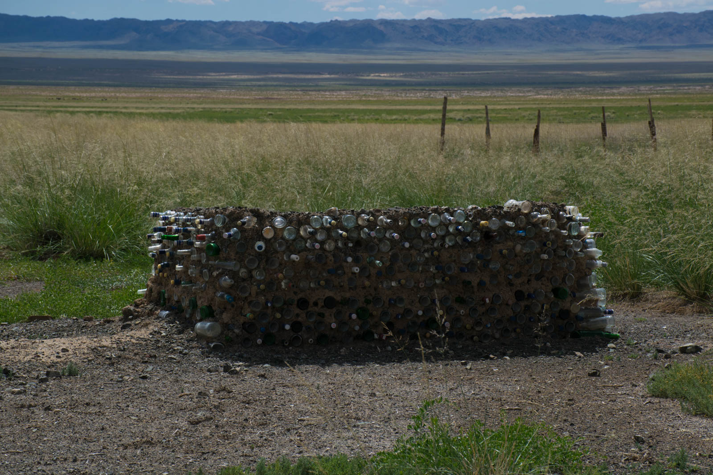
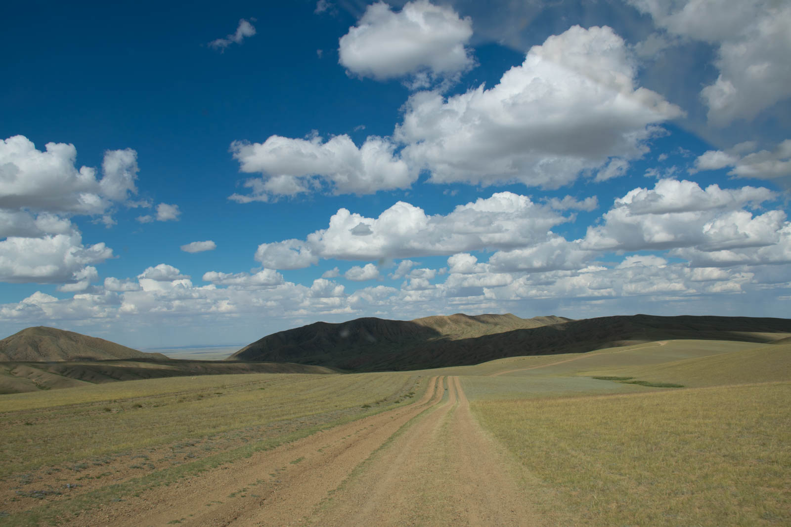
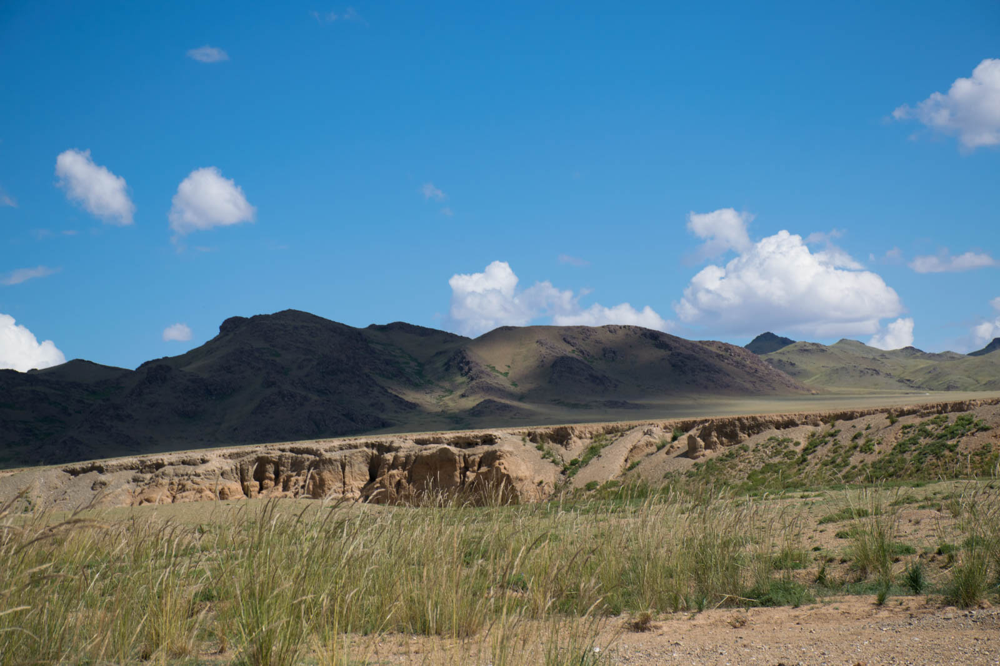
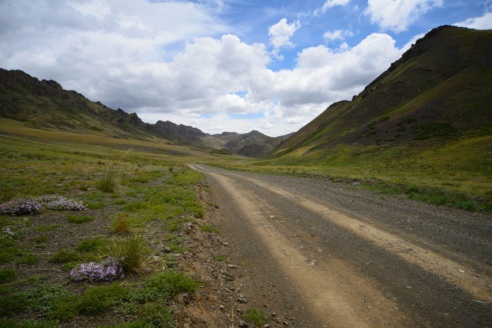
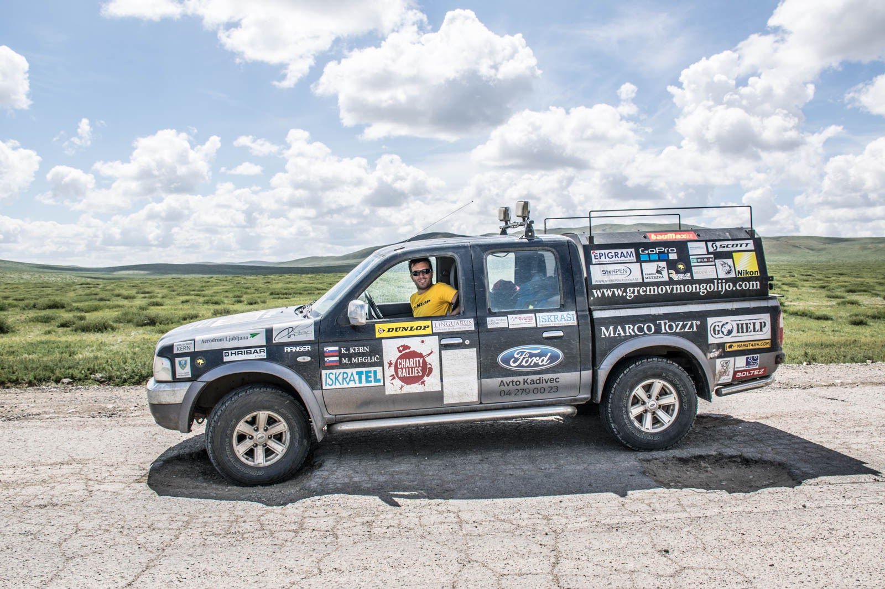
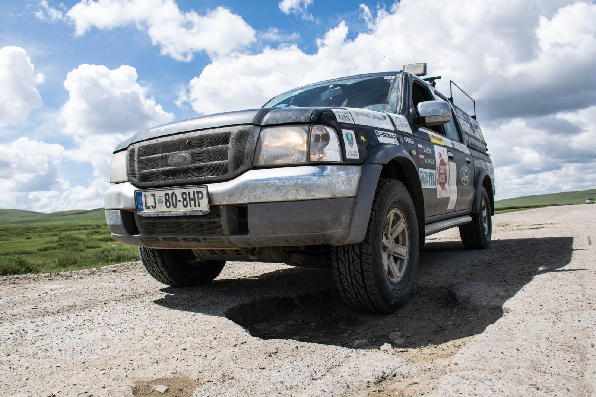
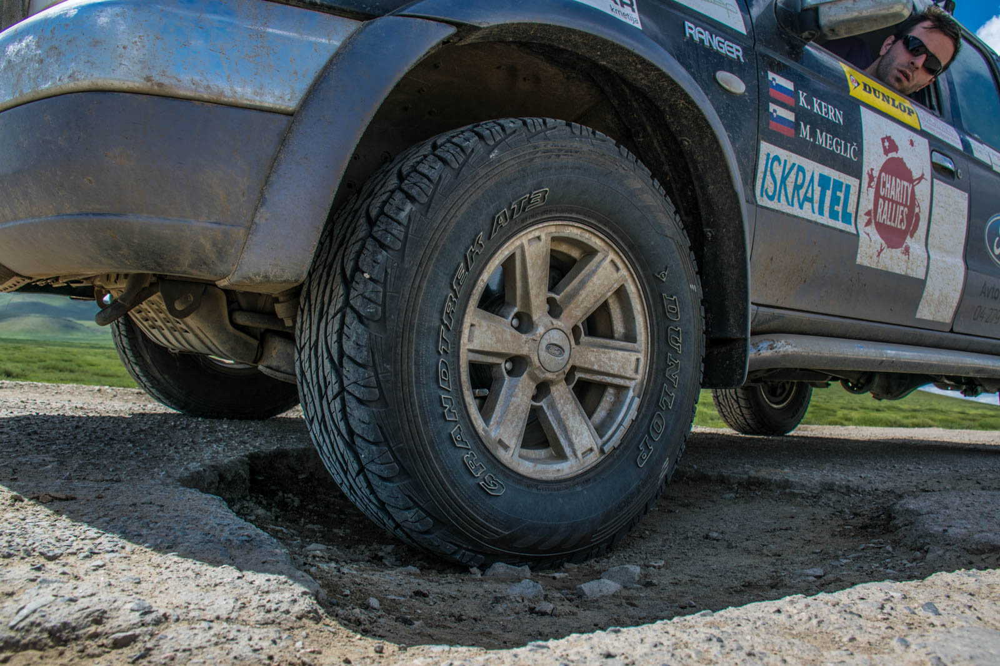
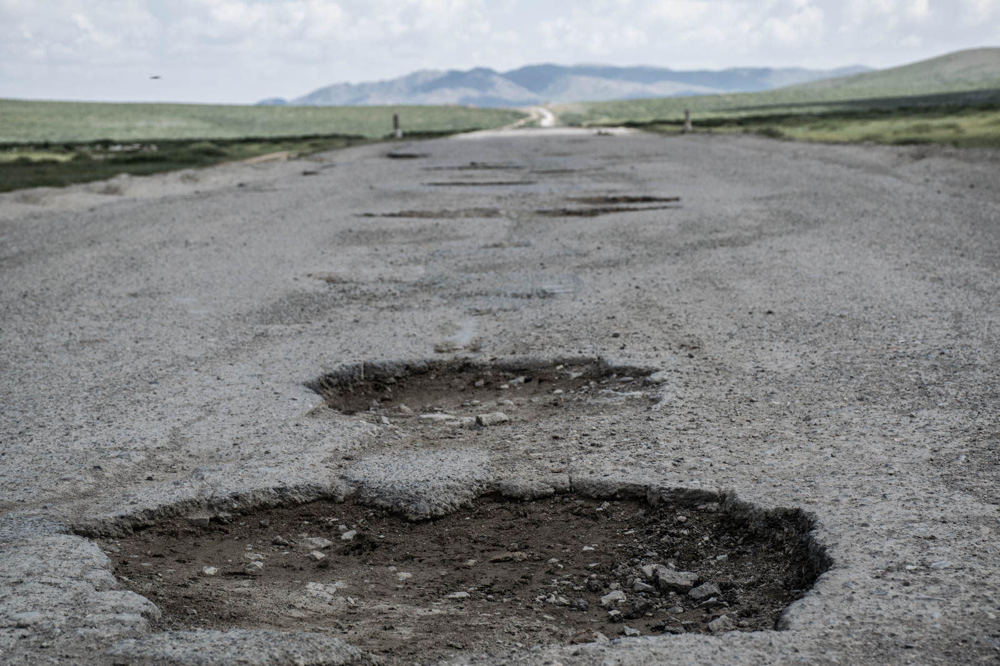
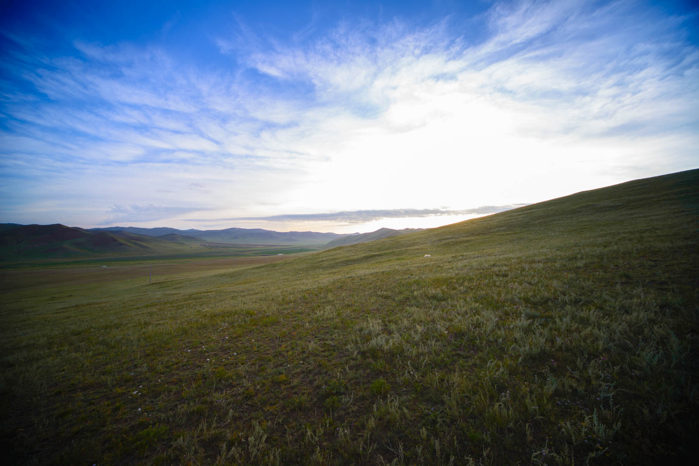
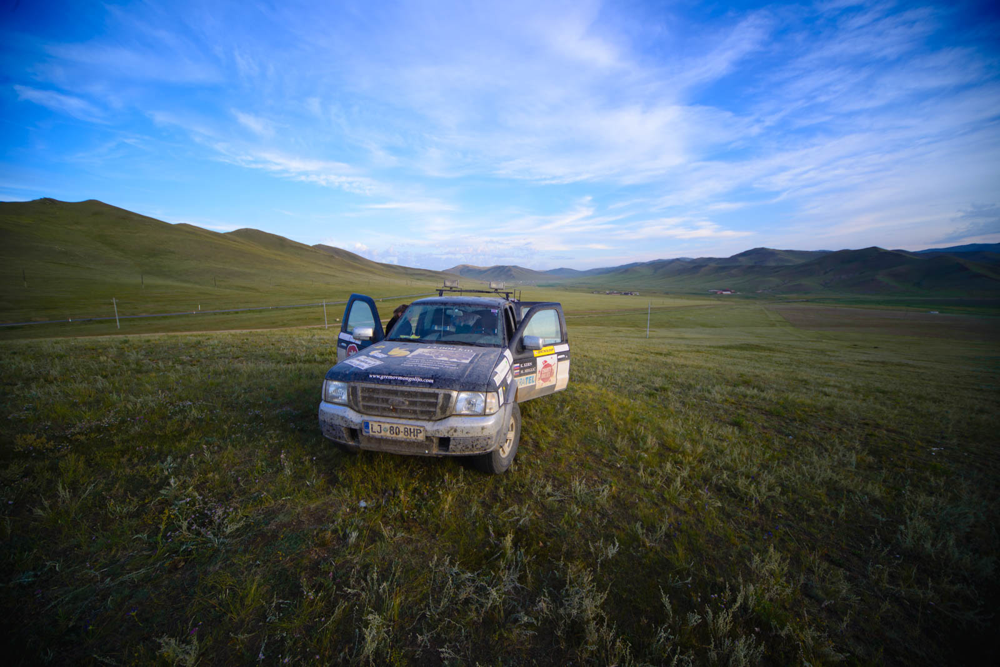

Vožnji na jug, po dveh dneh sledi vožnja na sever :). Tokrat se vrneva po isti poti nazaj, ker JZ del države sestavlja življenju neprijazno okolje, ceste pa vztrajno briše veter in ostali okoljski dejavniki pa tudi cesta na jug, ki je najbolj turističen je 1A za mongolske razmere. Med vračanjem opazujeva napredek delavcev pri izgradnji ceste, ki se je v dveh dneh podaljšala za 10 kilometrov. Vožnjo do Mandalgova sestavlja skakanje iz ceste na makedam, Matej pa iz vožnje v vožnjo izboljšuje potovalni čas in izmuzljivost luknjam.

       

Nekajkrat se ustaviva – v puščavi je pravilo, da se ustavi vsakomur, ki utegne imeti težave (a nisva v pomoč, vode imajo pa dovolj), na poti srečava rusko družino izpred parih dni, ki je ravno zamenjala počeno gumo, ter ročno dolijeva dizel, slovenskega porekla. Zaloge v prtljažniku nama kopnijo. Od Mandalgova do Ulaanbaatarja za volan prime Katja, nato pa sledi še ena izmena v kateri se prebijeva naprej proti severu. To »prebijanje« nama pobere kar nekaj časa, ker so tudi v glavnem mestu ceste v izgradnji – v znak dela se po zahodnem delu mesta vali bel prah, ki ga konstantno dvigujejo vozeči po makedamski poti.

 

Še vedno imava pred seboj slabih pet dni, zato greva pogledat še sever Mongolije. Blizu Darkhama se nama obeta festival, ki ga mogoče uspeva ujeti. Prebijeva se do predmestja Ulaanbataarja, kjer s Fordom »splezamo« na grič in zakurimo ogenj za polnočno večerjo.
