Bila sva že v Ulaanu, ker se mestu ne moreš izogniti, ko želiš priti iz enega dela države v drugega in se pri tem peljati po najboljših cestah, kar jih imajo. A danes tja odhajava zadnjič (vsaj za nekaj časa:)).  Sledi vožnja in opažanje, da sva se že močno privadila na njihov način upravljanja vozila. Hupanje, ki sva ga pred potovanjem dojemala kot izražanje agresivnosti, arogance, je dobilo nov pomen. To je najučinkovitejše sredstvo preko katerega sporočiš oziroma opozoriš nase, ko npr. prehitevaš – da tisti, ki je »prehitevan« ostane na svojem pasu in preneha iskati popolne linije med luknjami.

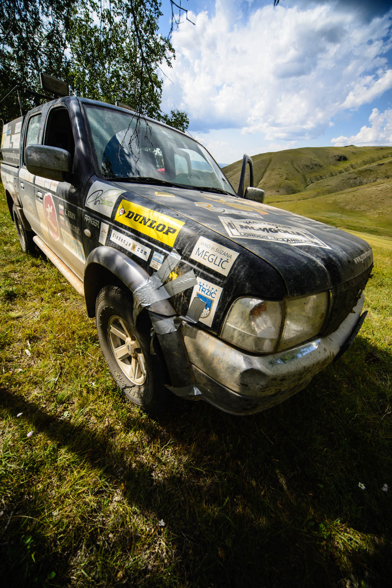 

Veliko vozil ima volan na levi strani avta, ker so ta vozila sicer cenejša – na žalost pa manj varna. Predvsem je vožnja naporna za tiste na sovoznikovem sedežu – ko se voznik enkrat odloči prehitevati, to zna dvigniti utrip.Število potnikov v vozilu je tudi poglavje zase. Nimam pojma, kje najdejo prostor v tovornjaku, ki je prvotno za štiri ljudi, notri pa se jih stlači kar devet. Kapo dol za izkoriščanje prostora.Ko je čas za kosilo, najdeva hrib, na katerem nama delajo senco breze. Prostor je kot nalašč za pospravljanje Forda preden dobi nove lastnike. In to je tudi mesto zadnje oddaje signala, kje se nahajava (glej zemljevid).

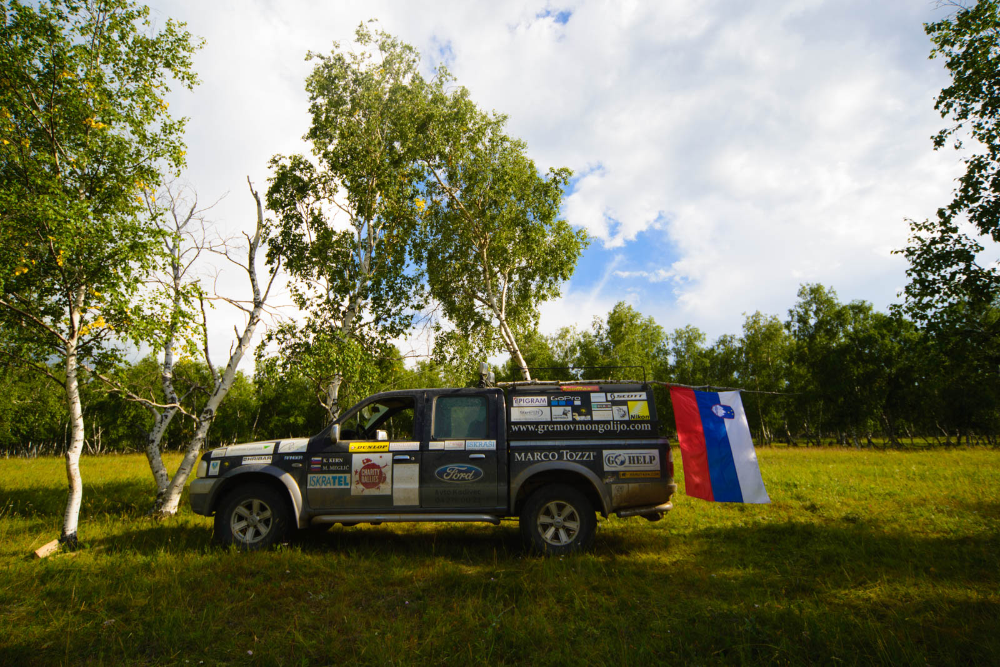 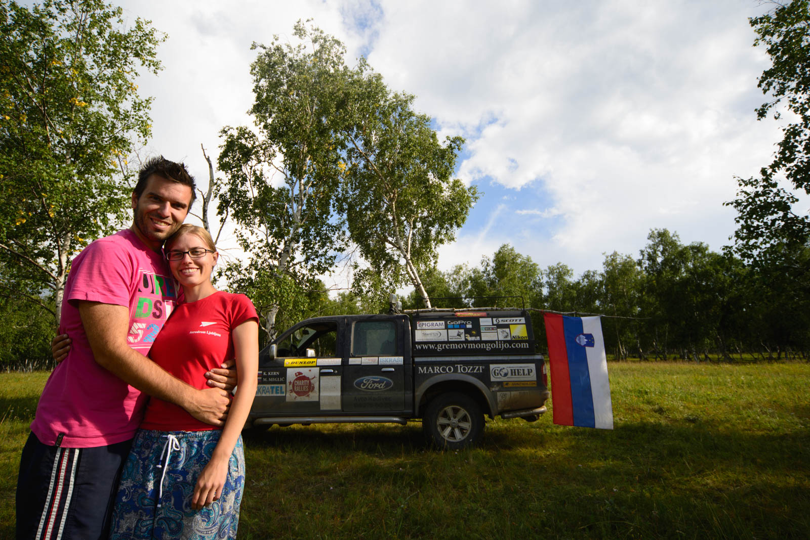 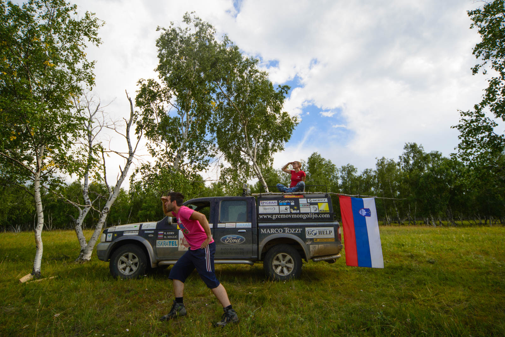 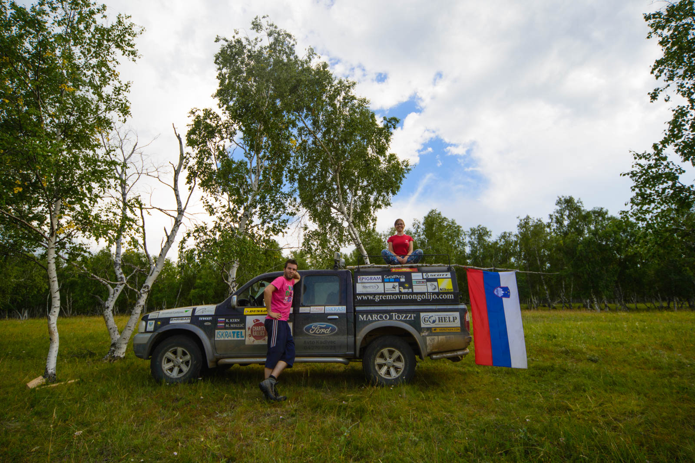 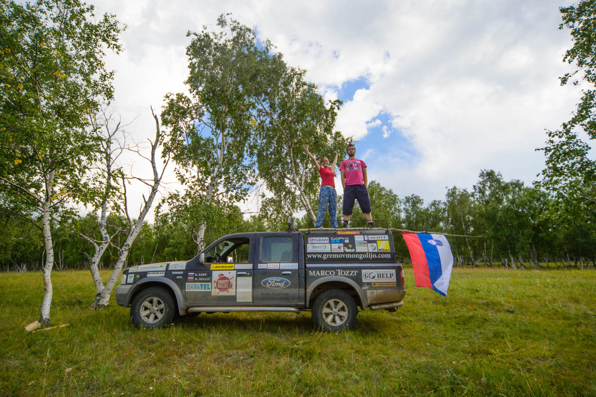 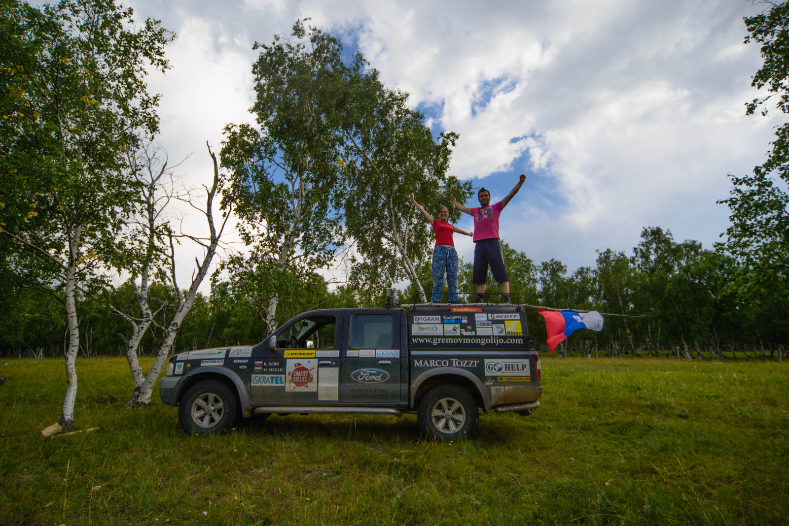 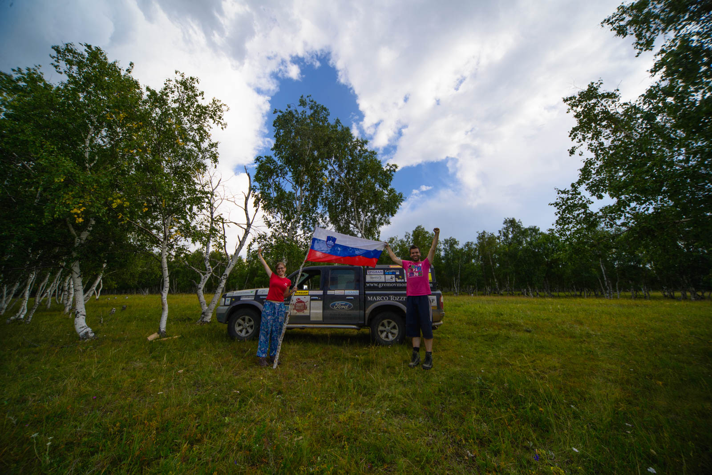 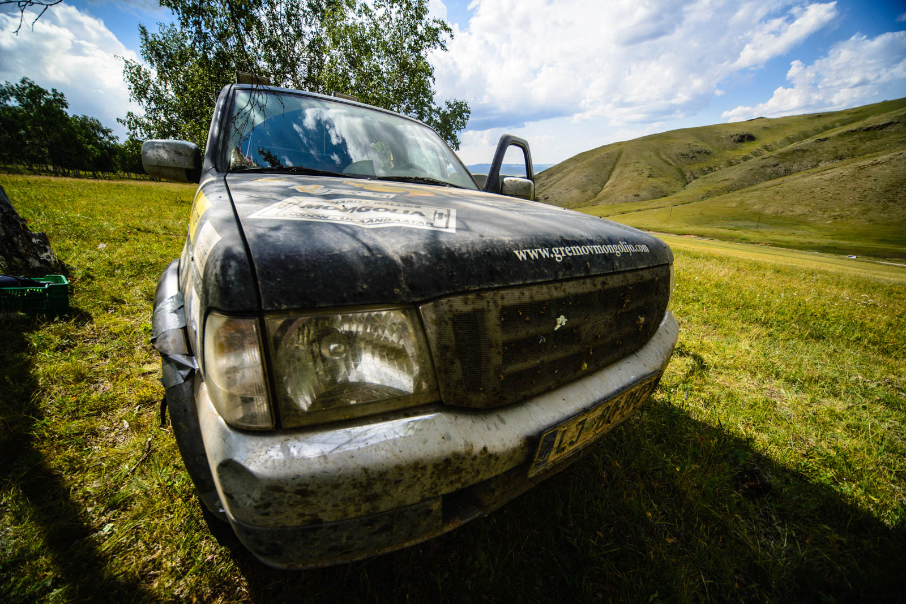 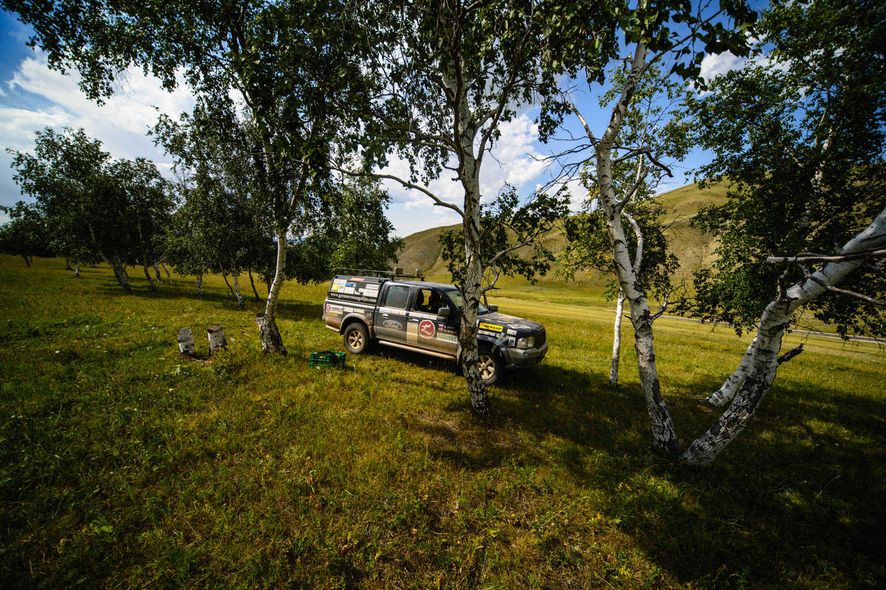 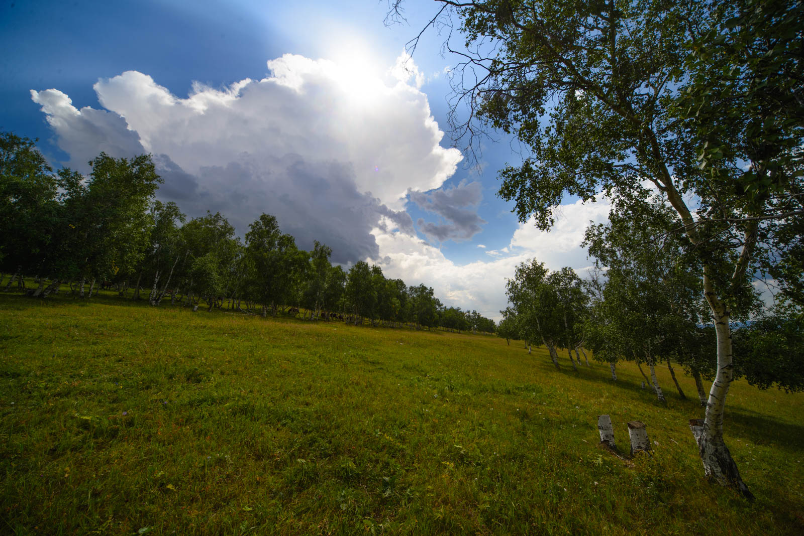

Ulaanbaatar naju sprejme pozno popoldne, kjer si poiševa prenočitev, tokrat na udobni podlagi – postelji :).
