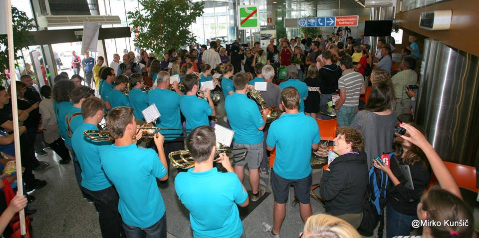

Letiva proti Sloveniji in varno pristaneva na Brniku. Realno je, da bo kdo tam. Pričakujeva 20-30 ljudi, je le sredi popoldneva. Pri čakanju na prtljago naju pozdravi dobrodošlica na ekranu, v prvem nadstropju pa Luka in Julija igrata na kitaro in pojeta, pa cela družina okrog naju. Ko končno dobiva vso prtljago, se odpraviva ven, tam pa šok. Fotografi, novinarji, televizija, sponzorji. Pa seveda gruča prijateljev, kar 150 njih. Pihalni orkester Tržič igra, Pevski zbor Carmen Manet poje, baloni in transparenti vsepovsod.  Najin nasmeh pa tak, da ga ne bova pozabila nikoli. Vse se poklopi, prepelješ se čez pol sveta, in prideš zdrav nazaj. Vmes pa doživiš osebno zmago, samoizpopolnitev. Maslow se v tem trenutku lahko samo skrije, ma kakšna piramida, matrika zadovoljstva je zapolnjena. Intervjujem kar ni in ni konca, vsi so tu. Odpravimo se v sejno sobo Aerodroma Ljubljana, kjer na hitro povzameva dogajanje v Mongoliji, za vse domače.  Nato pa na pico, in domov. Pod domač tuš, vohat gorski zrak … in spat v svojo posteljo. Mongolija, lepa in tako daleč. Doma… je pa doma. 

Rada bi se zahvalila vsem in vsakomur za vašo pomoč in doprinos na tem čudovitem projektu. Zakon ste in brez vas nama ne bi uspelo. Hvala vam za vaša srca.

Sva Katja Kern in Matej Meglič in to je najino leto.
